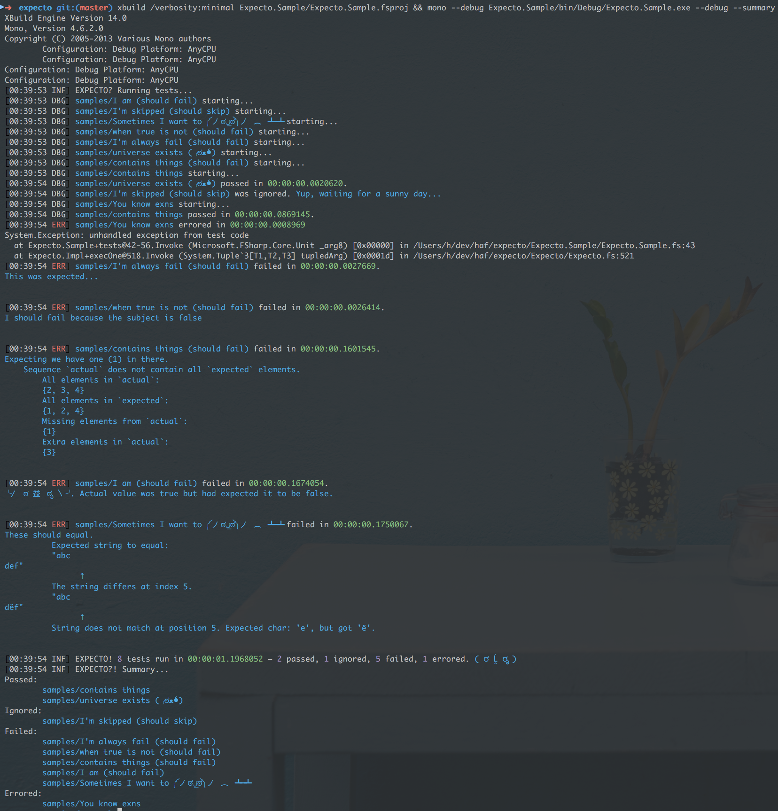
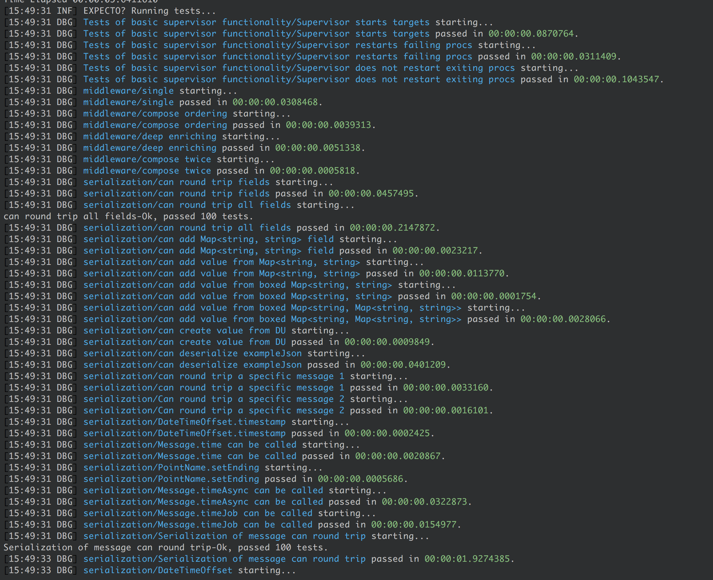

# expecto

[](https://travis-ci.org/haf/expecto)

Expecto is a unit testing library for F#. It's a fork of Fuchu aiming to be
properly updated and pushed to nuget when PRs come in. It aims to be an
opinionated testing framework with batteries included, while still being
compositional (just like Suave and Logary are).



In your paket.dependencies:

```
nuget Expecto
nuget Expecto.PerfUtil
nuget Expecto.FsCheck
```

Tests should be first-class values so that you can move them around and execute
them in any context that you want.

Let's have look at what an extensive unit test suite looks like when running
with Expecto:



## Testing "Hello world"

The test runner is the test assembly itself. It's recommended to compile your
test assembly as a console application. You can run a test directly like this:

```fsharp
open Expecto

[<Tests>]
let tests =
  testCase "yes" <| fun () ->
    let subject = "Hello world"
    Expect.equal subject "Hello World"
                 "The strings should equal"

[<EntryPoint>]
let main args =
  runTestsInAssembly defaultConfig args
```

The base class is called `Expect`, containing functions you can use to assert
with. A testing library without a good assertion library is like love without
kisses.

Now compile and run! `xbuild Sample.fsproj && mono --debug bin/Debug/Sample.exe`


## Running tests

Here's the simplest test possible:

```fsharp
open Expecto

let simpleTest =
  testCase "A simple test" <| fun _ ->
    let expected = 4
    Expect.equal expected (2+2) "2+2 = 4"
```

Then run it like this, e.g. in the interactive or through a console app.

```fsharp
runTests defaultConfig simpleTest
```

which returns 1 if any tests failed, otherwise 0. Useful for returning to the
operating system as error code.

### `runTests`

Signature `ExpectoConfig -> Test -> int`. Runs the passed tests with the passed
configuration record.

### `runTestsInAssembly`

Signature `ExpectoConfig -> string[] -> int`. Runs the tests in the current
assembly and also overrides the passed `ExpectoConfig` with the command line
parameters.

### `testList` for grouping

Tests can be grouped (with arbitrary nesting):

```fsharp
[<Tests>]
let tests =
  testList "A test group" [
    testCase "one test" <| fun _ ->
      Expect.equal (2+2) 4 "2+2"
    testCase "another test that fails" <| fun _ ->
      Expect.equal (3+3) 5 "3+3"
  ]
```

### Filtering with `filter`

You can single out tests by filtering them by name (e.g. in the
interactive/REPL). For example:

```fsharp
open Expecto
open MyLib.Tests
integrationTests // from MyLib.Tests
|> Test.filter (fun s -> s.EndsWith "another test") // the filtering function
|> run // from Expecto
```

### Focusing tests

It is often convenient, when developing to be able to run a subset of specs. 
Expecto allows you to focus specific test cases or tests list by putting `f` before *testCase* or *testList* or `F` before attribute *Tests*(when reflection tests discovery is used).

```fsharp
open Expecto

[<FTests>]
let someFocusedTest = testCase "will run" <| fun _ -> Expect.equal (2+2) 4 "2+2"
[<Tests>]
let someUnfocusedTest = test "skipped" { Expect.equal (2+2) 1 "2+2?" } 
```

or

```fsharp
open Expecto

[<Tests>]
let focusedTests = 
  testList "unfocused list" [
    ftestList "focused list" [
      testCase "will run" <| fun _ -> Expect.equal (2+2) 4 "2+2"
      ftestCase "will run" <| fun _ -> Expect.equal (2+2) 4 "2+2"
      test "will run" { Expect.equal (2+2) 4 "2+2" }
    ]
    testList "unfocused list" [
      testCase "skipped" <| fun _ -> Expect.equal (2+2) 1 "2+2?"
      ftestCase "will run" <| fun _ -> Expect.equal (2+2) 4 "2+2"
      test "skipped" { Expect.equal (2+2) 1 "2+2?" }
      ftest "will run" { Expect.equal (2+2) 4 "2+2" }
    ]
    testCase "skipped" <| fun _ -> Expect.equal (2+2) 1 "2+2?"
  ]
``` 

### Pending tests

You can mark an individual spec or container as Pending. This will prevent the spec (or specs within the list) from running.
You do this by adding a `p` before *testCase* or *testList* or `P` before *Tests* attribute(when reflection tests discovery is used).

```fsharp
open Expecto

[<PTests>]
let skippedTestFromReflectionDiscovery = testCase "skipped" <| fun _ -> 
    Expect.equal (2+2) 4 "2+2"

[<Tests>]
let myTests =
  testList "normal" [
    testList "unfocused list" [
      ptestCase "skipped" <| fun _ -> Expect.equal (2+2) 1 "2+2?"
      testCase "will run" <| fun _ -> Expect.equal (2+2) 4 "2+2"
      ptest "skipped" { Expect.equal (2+2) 1 "2+2?" }
    ]
    testCase "will run" <| fun _ -> Expect.equal (2+2) 4 "2+2"
    ptestCase "skipped" <| fun _ -> Expect.equal (2+2) 1 "2+2?"
    ptestList "skipped list" [
      testCase "skipped" <| fun _ -> Expect.equal (2+2) 1 "2+2?"
      ftestCase "skipped" <| fun _ -> Expect.equal (2+2) 1 "2+2?"
    ]
  ]
```  

## Expectations

All expect-functions have the signature `actual -> expected -> string -> unit`, leaving out `expected` when obvious from the function.

### `Expect` module

This module is your main entry-point when asserting.

 - `throws`
 - `throwsC`
 - `throwsT`
 - `isNone`
 - `isSome`
 - `isChoice1Of2`
 - `isChoice2Of2`
 - `isNull`
 - `isNotNull`
 - `isLessThan`
 - `isLessThanOrEqual`
 - `isGreaterThan`
 - `isGreaterThanOrEqual`
 - `floatEqual`
 - `notEqual`
 - `isFalse`
 - `isTrue`
 - `sequenceEqual`
 - `stringContains` – Expect the string `subject` to contain `substring` as part
   of itself.  If it does not, then fail with `format` and `subject` and
   `substring` as part of the error message.
 - `stringStarts` – Expect the string `subject` to start with `prefix` and if it
   does not then fail with `format` as an error message together with a
   description of `subject` and `prefix`.
 - `contains : 'a seq -> 'a -> string -> unit` – Expect the sequence to contain the item.
 - `streamsEqual` – Expect the streams to be byte-wise identical.

## `main argv` – how to run console apps

Parameters available if you use `Tests.runTestsInAssembly defaultConfig argv` in your code:

 - `--debug`: Extra verbose output for your tests.
 - `--sequenced`: Run all tests in sequence.
 - `--parallel`: (default) Run all tests in parallel.
 - `--filter <hiera>`: Filter a specific hierarchy to run (**TBD**).
 - `--filter-test-list <substring>`: Filter a specific test list to run
   (**TBD**).
 - `--filter-test-case <substring>`: Filter a specific test case to run
   (**TBD**).

### The config

If you prefer using F# to configure the tests, you can set the properties of the
ExpetoConfig record, that looks like:

```fsharp
{ /// Whether to run the tests in parallel. Defaults to true, because your
  /// code should not mutate global state by default.
  parallel : bool
  /// An optional filter function. Useful if you only would like to run a
  /// subset of all the tests defined in your assembly.
  filter   : Test -> Test
  /// Allows the test printer to be parametised to your liking.
  printer : TestPrinters }
```

By doing a `let config = { defaultConfig with parallel = true }`, for example.

## FsCheck usage

Reference [FsCheck](https://github.com/fscheck/FsCheck) and Expecto.FsCheck to
test properties:

```fsharp
let config = { FsCheck.Config.Default with MaxTest = 10000 }

let properties =
  testList "FsCheck" [
    testProperty "Addition is commutative" <| fun a b ->
      a + b = b + a

    // you can also override the FsCheck config
    testPropertyWithConfig config "Product is distributive over addition" <|
      fun a b c ->
        a * (b + c) = a * b + a * c
  ]

run properties
```

You can freely mix testProperty with testCase and testList.

## BenchmarkDotNet usage

The integration with
[BenchmarkDotNet](https://perfdotnet.github.io/BenchmarkDotNet/index.htm).

```fsharp
open Expecto
open BenchmarkDotNet

module Types =
  type Y = { a : string; b : int }

type Serialiser =
  abstract member Serialise<'a> : 'a -> unit

type MySlowSerialiser() =
  interface Serialiser with
    member x.Serialise _ =
      System.Threading.Thread.Sleep(30)

type FastSerialiser() =
  interface Serialiser with
    member x.Serialise _ =
      System.Threading.Thread.Sleep(10)

type FastSerialiserAlt() =
  interface Serialiser with
    member x.Serialise _ =
     System.Threading.Thread.Sleep(20)

type Serialisers() =
  let fast, fastAlt, slow =
    FastSerialiser() :> Serialiser,
    FastSerialiserAlt() :> Serialiser,
    MySlowSerialiser() :> Serialiser

  [<Benchmark>]
  member x.FastSerialiserAlt() = fastAlt.Serialise "Hello world"

  [<Benchmark>]
  member x.SlowSerialiser() = slow.Serialise "Hello world"

  [<Benchmark(Baseline = true)>]
  member x.FastSerialiser() = fast.Serialise "Hello world"

open Types

[<Tests>]
let tests =
  testList "performance tests" [
    benchmark<Serialisers> "three serialisers" benchmarkConfig ignore
  ]
```

In the current code-base I'm just printing the output to the console; and by
default all tests are run in parallel; so you'll need to use `--sequenced` as
input to your exe, or set parallel=false in the config to get valid results.

To read more about how to benchmark with BenchmarkDotNet, see its [Getting
started](https://perfdotnet.github.io/BenchmarkDotNet/GettingStarted.htm) guide.

Happy benchmarking!

## You're not alone!

Others have discovered the beauty of tests-as-values in easy-to-read F#.

* [Suave](https://github.com/SuaveIO/suave/tree/master/src/Suave.Tests)
* [Logary](https://github.com/logary/logary)

## Sending e-mail on failure – custom printers

The printing mechanism in Expecto is based on the [Logary
Facade](https://github.com/logary/logary#the-logary-facade-adapter), which
grants some privileges, like being able to use **any** Logary target to print.
Just follow the above link to learn how to initialise Logary. Then if you wanted
to get notified over e-mail whenever one of your tests fail, configure Logary
with `Logary.Targets.Mailgun`:

```fsharp
open Logary
open Logary.Configuration
open Logary.Adapters.Facade
open Logary.Targets
open Hopac
open Mailgun
open System.Net.Mail

let main argv =
  let mgc =
    MailgunLogaryConf.Create(
      MailAddress("travis@example.com"),
      [ MailAddress("Your.Mail.Here@example.com") ],
      { apiKey = "deadbeef-2345678" },
      "example.com", // sending domain of yours
      Error) // cut-off level

  use logary =
    withLogaryManager "MyTests" (
      withTargets [
        LiterateConsole.create LiterateConsole.empty "stdout"
        Mailgun.create mgc "mail"
      ]
      >> withRules [
        Rule.createForTarget "stdout"
        Rule.createForTarget "mail"
      ])
    |> run

  // initialise Logary Facade with Logary proper:
  LogaryFacadeAdapter.initialise<Expecto.Logging.Logger> logary

  // run all tests
  Tests.runTestsInAssembly defaultConfig args
```

## About test parallelism

Since the default is to run all of your tests in parallel, it's important that
you don't use global variables, global singletons or mutating code. If you do,
you'll have to slow down all of your tests by sequencing them (or use locks in
your testing code).

Furthermore, `printfn` and sibling functions aren't thread-safe, i.e. a given
string may be logged in many passes and concurrent calls to printfn and
Console.X-functions have their outputs interleaved. If you want to log from
tests, you can use code like:

```fsharp
open Expecto.Logging
open Expecto.Logging.Message

let logger = Log.create "MyTests"

// stuff here

testCase "reading prop" <| fun _ ->
  let subject = MyComponent()
  // this will output to the right test context:
  logger.info(
    eventX "Has prop {property}"
    >> setField "property" subject.property)
  Expect.equal subject.property "Goodbye" "Should have goodbye as its property"
```

## About upgrading from Fuchu

In VsCode, search files for: `Assert.Equal\s*\(\s*((;|.)+?)\s*,\s*(.*?),\s*(.*?)\)`
and replace with `Expect.equal $4 $3 $1`.
