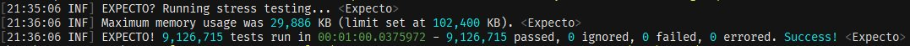
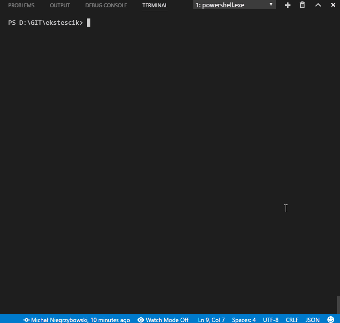

<h1 align="center">Expecto</h1>
<p align="center">An advanced testing library for F#</p>

<p align="center">
<a href="https://travis-ci.org/haf/expecto"></a>
<a href="https://ci.appveyor.com/project/haf/expecto"></a>
<a href="https://www.nuget.org/packages/expecto"></a>

<a href="https://opensource.org/licenses/Apache-2.0"></a>
<a href="https://github.com/sponsors/haf" title="Sponsor this"></a>
</p>
<br>

Expecto aims to make it easy to test CLR based software; be it with unit tests, stress tests, regression tests or
property based tests. Expecto tests are parallel and async by default, so that you can use all your cores for
testing your software. This also opens up a new way of catching threading and memory issues for free using stress
testing.



With Expecto you write tests as values. Tests can be composed, reduced, filtered, repeated and passed as values, because
they are values. This gives the programmer a lot of leverage when writing tests.  Setup and teardown are just simple
functions, no need for attributes.

Expecto comes with batteries included with an integrated test runner, but it's still open for extension due to its
compositional model.

Expecto comes with performance testing, making statistically sound performance comparison simple.

Expecto also provides a simple API for property based testing using FsCheck.

## Quickstart

    dotnet new install Expecto.Template::*
    dotnet new expecto -n PROJECT_NAME -o FOLDER_NAME
    
Follow [Smooth Testing](https://www.youtube.com/channel/UC2SN9CUu9LlOBukXXv_bT5Q) on YouTube to learn the basics.

What follows is the Table of Contents for this README, which also serves as the documentation for the project.

<!-- toc -->

- [Quickstart](#quickstart)
- [Installing](#installing)
- [IDE integrations](#ide-integrations)
- [.NET integration](#net-integration)
  - [Prettify stacktraces/ship test logs](#prettify-stacktracesship-test-logs)
  - [TestResults file](#testresults-file)
- [.NET support](#net-support)
- [Testing "Hello world"](#testing-hello-world)
- [Running tests](#running-tests)
  - [`runTestsWithCLIArgs`](#runtestswithcliargs)
  - [`runTestsWithCLIArgsAndCancel`](#runtestswithcliargsandcancel)
  - [`runTestsInAssemblyWithCLIArgs`](#runtestsinassemblywithcliargs)
  - [`runTestsInAssemblyWithCLIArgsAndCancel`](#runtestsinassemblywithcliargsandcancel)
  - [Filtering with `filter`](#filtering-with-filter)
  - [Shuffling with `shuffle`](#shuffling-with-shuffle)
  - [Stress testing](#stress-testing)
- [Writing tests](#writing-tests)
  - [Normal tests](#normal-tests)
  - [`testList` for grouping](#testlist-for-grouping)
  - [Test fixtures](#test-fixtures)
  - [Theory tests](#theory-tests)
  - [Pending tests](#pending-tests)
  - [Focusing tests](#focusing-tests)
  - [Sequenced tests](#sequenced-tests)
  - [Parameterised tests with `testParam`](#parameterised-tests-with-testparam)
  - [Setup and teardown](#setup-and-teardown)
  - [Property based tests](#property-based-tests)
    - [Link collection](#link-collection)
    - [Code from FsCheck](#code-from-fscheck)
- [Expectations with `Expect`](#expectations-with-expect)
  - [`Expect` module](#expect-module)
  - [`Performance` module](#performance-module)
    - [Example](#example)
  - [Performance.findFastest](#performancefindfastest)
- [`main args` and command line – how to run console apps examples](#main-args-and-command-line--how-to-run-console-apps-examples)
- [Contributing and building](#contributing-and-building)
- [BenchmarkDotNet usage](#benchmarkdotnet-usage)
- [You're not alone!](#youre-not-alone)
  - [Testing hardware](#testing-hardware)
- [Sending e-mail on failure – custom printers](#sending-e-mail-on-failure--custom-printers)
- [About test parallelism](#about-test-parallelism)
  - [What does 'expected to have type TestCode' mean?](#what-does-expected-to-have-type-testcode-mean)
  - [My tests are hanging and I can't see why](#my-tests-are-hanging-and-i-cant-see-why)

<!-- tocstop -->


## Installing

In your `paket.dependencies`:

    nuget Expecto
    nuget Expecto.BenchmarkDotNet
    nuget Expecto.FsCheck
    nuget Expecto.Hopac

Tests should be first-class values so that you can move them around and execute
them in any context that you want.

Let's have look at what an extensive unit test suite looks like when running
with Expecto:


## IDE integrations

There's a NuGet `Expecto.VisualStudio.TestAdapter` for Visual Studio integration.

## .NET integration

You can use `dotnet run` or `dotnet watch` from the command line.

    dotnet watch -p MyProject.Tests run -f net6.0


### Prettify stacktraces/ship test logs

To get a [complete logging solution][logary] and stacktrace highlighting, parsing and
the ability to ship your build logs somewhere, also add these:

    nuget Logary.Adapters.Facade prerelease

And in your tests:

```fsharp
open Hopac
open Logary
open Logary.Configuration
open Logary.Adapters.Facade
open Logary.Targets

[<EntryPoint>]
let main argv =
  let logary =
    Config.create "MyProject.Tests" "localhost"
    |> Config.targets [ LiterateConsole.create LiterateConsole.empty "console" ]
    |> Config.processing (Events.events |> Events.sink ["console";])
    |> Config.build
    |> run
  LogaryFacadeAdapter.initialise<Expecto.Logging.Logger> logary

  // Invoke Expecto:
  runTestsInAssemblyWithCLIArgs [] argv
```

Now, when you use Logary in your app, you can see your log messages
together with the log output/summary/debug printing of Expecto,
and the output won't be interlaced due to concurrency.

### TestResults file

Use `--nunit-summary TestResults.xml` or `--junit-summary TestResults.junit.xml` (JUnit support is incomplete).

## .NET support

[Expecto has its own .NET template](https://github.com/MNie/Expecto.Template)! You could create a base .NET
project with expecto.  How to do that? Simply write following lines:

    dotnet new install 'Expecto.Template::*'
    dotnet new expecto -n PROJECT_NAME -o FOLDER_NAME

How to run it?

    dotnet restore
    dotnet run



## Testing "Hello world"

The test runner is the test assembly itself. It's recommended to compile your test assembly as a console application.
You can run a test directly like this:

```fsharp
open Expecto

let tests =
  test "A simple test" {
    let subject = "Hello World"
    Expect.equal subject "Hello World" "The strings should equal"
  }

[<EntryPoint>]
let main args =
  runTestsWithCLIArgs [] args tests
```

No magic is involved here. We just created a single test and hooked it
into the assembly entry point.

The `Expect` module contains functions that you can use to assert with.
A testing library without a good assertion library is like love without kisses.

Now compile and run! `xbuild Sample.fsproj && mono --debug bin/Debug/Sample.exe`

## Running tests

Here's a simple test:

```fsharp
open Expecto

let simpleTest =
  testCase "A simple test" <| fun () ->
    let expected = 4
    Expect.equal expected (2+2) "2+2 = 4"
```

Then run it like this, e.g. in the interactive or through a console app.

```fsharp
runTestsWithCLIArgs [] [||] simpleTest
```

which returns 1 if any tests failed, otherwise 0. Useful for returning to the
operating system as error code.

It's worth noting that `<|` is just a way to change the associativity of the
language parser. In other words; it's equivalent to:

```fsharp
testCase "A simple test" (fun () ->
  Expect.equal 4 (2+2) "2+2 should equal 4")
```

### `runTestsWithCLIArgs`

Signature `CLIArguments seq -> string[] -> Test -> int`. Runs the passed tests
and also overrides the passed `CLIArguments` with the command line parameters.

### `runTestsWithCLIArgsAndCancel`

Signature `CancellationToken -> ExpectoConfig -> Test -> int`. Runs the passed tests
and also overrides the passed `CLIArguments` with the command line parameters.

### `runTestsInAssemblyWithCLIArgs`

Signature `CLIArguments seq -> string[] -> int`. Runs the tests in the current
assembly and also overrides the passed `CLIArguments` with the command line
parameters. All tests need to be marked with the `[<Tests>]` attribute.

### `runTestsInAssemblyWithCLIArgsAndCancel`

Signature `CancellationToken -> CLIArguments seq -> string[] -> int`. Runs the tests in the current
assembly and also overrides the passed `CLIArguments` with the command line
parameters. All tests need to be marked with the `[<Tests>]` attribute.

### Filtering with `filter`

You can single out tests by filtering them by name (e.g. in the
interactive/REPL). For example:

```fsharp
open Expecto
open MyLib.Tests
integrationTests // from MyLib.Tests
|> Test.filter defaultConfig.joinWith.asString (fun z -> (defaultConfig.joinWith.format z).StartsWith "another test" ) // the filtering function
|> runTestsWithCLIArgs [] [||]
```

### Shuffling with `shuffle`

You can shuffle the tests randomly to help ensure there are no run order dependencies.
For example:

```fsharp
open Expecto
open MyLib.Tests
myTests // from MyLib.Tests
|> Test.shuffle defaultConfig.joinWith.asString
|> runTestsWithCLIArgs [] [||]
```

### Stress testing

Tests can also be run randomly for a fixed length of time.
The idea is that this will catch the following types of bugs:

- Memory leaks.
- Threading bugs running same test at same time.
- Rare threading bugs.
- Rare property test fails.

The default config will run FsCheck tests with a higher end size than normal.

## Writing tests

Expecto supports the following test constructors:

- normal test cases with `testCase`, `testCaseAsync` and `testCaseTask`
- lists of tests with `testList`
- test fixtures with `testFixture`, `testFixtureAsync`, `testFixtureTask`
- pending tests (that aren't run) with `ptestCase`, `ptestCaseAsync` and `ptestCaseTask`
- focused tests (that are the only ones run) with `ftestCase`,
   `ftestCaseAsync` and `ftestCaseTask`
- sequenced tests with `testSequenced` and `testSequencedGroup` (tests inside a
   group are run in sequence w.r.t each other)
- parametised tests with `testParam`
- testCases with the workflow builder `test`, `ptest`, `ftest` supporting
   deterministic disposal, loops and such
- property based tests with `testProperty`, `testPropertyWithConfig` and
  `testPropertyWithConfigs`, `testPropertyWithConfigsStdGen`,
  `testPropertyWithConfigStdGen` from `Expecto.FsCheck`
- performance tests with `Expecto.BenchmarkDotNet` and `benchmark<TBench> :
   string -> Test`.
- wrapping your test with a label with `testLabel`. If your root label is the
  same across your test project, you'll have an easier time filtering tests.

All of the above compile to a `Test` value that you can compose. For example,
you can compose a `test` and a `testCaseAsync` in a `testList` which you wrap in
`testSequenced` because all tests in the list use either `Expect.fasterThan` or
they are using `Expecto.BenchmarkDotNet` for performance tests.  You have to
remember that **the fully qualified names of tests need to be unique across your
test project.**

### Normal tests

- `test : string -> TestCaseBuilder` -  Builds a test case in a computation expression.
- `testAsync : string -> TestAsyncBuilder` - Builds an async test case in a computation expression.
- `testTask : string -> TestTaskBuilder` - Builds a task test case in a computation expression.
- `testCase : string -> (unit -> unit) -> Test` - Builds a test case from a test function.
- `testCaseAsync : string -> Async<unit> -> Test` - Builds an async test case from an async expression.
- `testCaseTask : string -> (unit -> Task<unit>) -> Test` - Builds an async test case from a function returning a task. Unlike async, tasks start right away and thus must be wrapped in a function so the task doesn't start until the test is run.

### `testList` for grouping

Tests can be grouped (with arbitrary nesting):

```fsharp
let tests =
  testList "A test group" [
    test "one test" {
      Expect.equal (2+2) 4 "2+2"
    }

    test "another test that fails" {
      Expect.equal (3+3) 5 "3+3"
    }

    testAsync "this is an async test" {
      let! x = async { return 4 }
      Expect.equal x (2+2) "2+2"
    }

    testTask "this is a task test" {
      let! n = Task.FromResult 2
      Expect.equal n 2 "n=2"
    }
  ]
  |> testLabel "samples"
```

Also have a look at [the
samples](https://github.com/haf/expecto/blob/master/Expecto.Sample/Expecto.Sample.fs).

### Test fixtures

- `testFixture : ('a -> unit -> unit) -> (seq<string * 'a>) -> seq<Test>`

The test fixture takes a factory and a sequence of partial tests. The `'a`
parameter will be inferred to the *function type*, such as
`MemoryStream -> 'a -> unit -> 'a`.

Example:

```fsharp
testList "Setup & teardown 3" [
  let withMemoryStream f () =
    use ms = new MemoryStream()
    f ms
  yield! testFixture withMemoryStream [
    "can read",
      fun ms -> ms.CanRead ==? true
    "can write",
      fun ms -> ms.CanWrite ==? true
  ]
]
```

- `testFixtureAsync : ('a -> unit -> Async<unit>) -> (seq<string * 'a>) -> seq<Test>`

The test fixture async takes a factory and a sequence of partial
tests. The `'a` parameter will be inferred to the *function type*,
such as `MemoryStream -> 'a -> 'a`.

Example:

```fsharp
testList "Setup & teardown 4" [
  let withMemoryStream f = async {
    use ms = new MemoryStream()
    do! f ms
  }
  yield! testFixture withMemoryStream [
    "can read",
      fun ms -> async { return ms.CanRead ==? true }
    "can write",
      fun ms -> async { return ms.CanWrite ==? true }
  ]
]
```


- `testFixtureTask : ('a -> unit -> Task<unit>) -> (seq<string * 'a>) -> seq<Test>`

The test fixture task takes a factory and a sequence of partial tests.
The `'a` parameter will be inferred to the *function type*, such as
`MemoryStream -> 'a -> 'a`.

Example:

```fsharp
testList "Setup & teardown 5" [
  let withMemoryStream f = task {
    use ms = new MemoryStream()
    do! f ms
  }
  yield! testFixture withMemoryStream [
    "can read",
      fun ms -> task { return ms.CanRead ==? true }
    "can write",
      fun ms -> task { return ms.CanWrite ==? true }
  ]
]
```

### Theory tests

- `testTheory : string -> seq<'a> -> ('a -> 'b) -> Test`

The test theory takes a name and a sequence of cases to test against.
The `'a` parameter will be inferred to the *sequence type*, such as `string -> seq<int> -> (int -> 'b) -> Test`.

Example:

```fsharp
testList "theory testing" [
  testTheory "odd numbers" [1; 3; 5] <| fun x ->
    Expect.isTrue (x % 2 = 1) "should be odd"
]
```

Theory tests can simulate multiple parameters via tuples. For example, passing input with an expected result

Example:

```fsharp
testList "theory testing with an expected result" [
  testTheory "sum numbers" [(1,1),2; (2,2),4] <| fun ((a,b), expected) ->
    Expect.equal (a+b) expected "should be equal"
]
```

### Pending tests

- `ptestCase`
- `ptest`
- `ptestAsync`
- `ptestTask`
- `ptestCaseAsync`
- `ptestCaseTask`
- `ptestTheory`
- `ptestTheoryAsync`
- `ptestTheoryTask`

You can mark an individual spec or container as Pending. This will prevent the spec (or specs within the list) from
running.  You do this by adding a `p` before *testCase* or *testList* or `P` before *Tests* attribute (when reflection
tests discovery is used).

```fsharp
open Expecto

[<PTests>]
let skippedTestFromReflectionDiscovery = testCase "skipped" <| fun () ->
    Expect.equal (2+2) 4 "2+2"

[<Tests>]
let myTests =
  testList "normal" [
    testList "unfocused list" [
      ptestCase "skipped" <| fun () -> Expect.equal (2+2) 1 "2+2?"
      testCase "will run" <| fun () -> Expect.equal (2+2) 4 "2+2"
      ptest "skipped" { Expect.equal (2+2) 1 "2+2?" }
      ptestAsync "skipped async" { Expect.equal (2+2) 1 "2+2?" }
    ]
    testCase "will run" <| fun () -> Expect.equal (2+2) 4 "2+2"
    ptestCase "skipped" <| fun () -> Expect.equal (2+2) 1 "2+2?"
    ptestList "skipped list" [
      testCase "skipped" <| fun () -> Expect.equal (2+2) 1 "2+2?"
      ftest "skipped" { Expect.equal (2+2) 1 "2+2?" }
    ]
  ]
```

Optionally, in the `TestCode` (function body):

- `Tests.skiptest`
- `Tests.skiptestf`

### Focusing tests

Focusing can be done with

- `ftestCase`
- `ftestList`
- `ftestCaseAsync`
- `ftestCaseTask`
- `ftest`
- `ftestAsync`
- `ftestTask`
- `ftestTheory`
- `ftestTheoryAsync`
- `ftestTheoryTask`

It is often convenient, when developing to be able to run a subset of specs.  Expecto allows you to focus specific test
cases or tests list by putting `f` before *testCase* or *testList* or `F` before attribute *Tests*(when reflection tests
discovery is used).

```fsharp
open Expecto
[<FTests>]
let someFocusedTest = test "will run" { Expect.equal (2+2) 4 "2+2" }
[<Tests>]
let someUnfocusedTest = test "skipped" { Expect.equal (2+2) 1 "2+2?" }
```

or

```fsharp
open Expecto

[<Tests>]
let focusedTests =
  testList "unfocused list" [
    ftestList "focused list" [
      testCase "will run" <| fun () -> Expect.equal (2+2) 4 "2+2"
      ftestCase "will run" <| fun () -> Expect.equal (2+2) 4 "2+2"
      test "will run" { Expect.equal (2+2) 4 "2+2" }
    ]
    testList "unfocused list" [
      testCase "skipped" <| fun () -> Expect.equal (2+2) 1 "2+2?"
      ftestCase "will run" <| fun () -> Expect.equal (2+2) 4 "2+2"
      test "skipped" { Expect.equal (2+2) 1 "2+2?" }
      ftest "will run" { Expect.equal (2+2) 4 "2+2" }
    ]
    testCase "skipped" <| fun () -> Expect.equal (2+2) 1 "2+2?"
  ]
```

Expecto accepts the command line argument `--fail-on-focused-tests`, which checks if focused tests exist.  This
parameter can be set in build scripts and allows CI servers to reject commits that accidentally included focused tests.

### Sequenced tests

You can mark an individual spec or container as Sequenced.  This will make sure these tests are run sequentially.  This
can be useful for timeout and performance testing.

```fsharp
[<Tests>]
let timeout =
  testSequenced <| testList "Timeout" [
    test "fail" {
      let test = TestCase(Test.timeout 10 (TestCode.Sync (fun _ -> Thread.Sleep 100)), Normal)
      async {
        let! eval = Impl.evalTests defaultConfig test
        let result = Impl.TestRunSummary.fromResults eval
        result.failed.Length ==? 1
      } |> Async.RunSynchronously
    }
    test "pass" {
      let test = TestCase(Test.timeout 1000 (TestCode.Sync ignore), Normal)
      async {
        let! eval = Impl.evalTests defaultConfig test
        let result = Impl.TestRunSummary.fromResults eval
        result.passed.Length ==? 1
      } |> Async.RunSynchronously
    }
  ]
```

You can also mark a test list as a Sequenced Group.  This will make sure the tests in this group are not run at the same
time.

```fsharp
[<Tests>]
let timeout =
  let lockOne = obj()
  let lockTwo = obj()
  testSequencedGroup "stop deadlock" <| testList "possible deadlock" [
    testAsync "case A" {
      lock lockOne (fun () ->
        Thread.Sleep 10
        lock lockTwo (fun () ->
          ()
        )
      )
    }
    testAsync "case B" {
      lock lockTwo (fun () ->
        Thread.Sleep 10
        lock lockOne (fun () ->
          ()
        )
      )
    }
  ]
```

### Parameterised tests with `testParam`

- `testParam`

```fsharp
testList "numberology 101" (
  testParam 1333 [
    "First sample",
      fun value () ->
        Expect.equal value 1333 "Should be expected value"
    "Second sample",
      fun value () ->
        Expect.isLessThan value 1444 "Should be less than"
] |> List.ofSeq)
```

### Setup and teardown

A simple way to perform setup and teardown is by using `IDisposable` resources:

```fsharp
let simpleTests =
    testList "simples" [
        test "test one" {
            use resource = new MyDatabase()
            // test code
        }
    ]
```

For more complex setup and teardown situations we can write one or more setup
functions to manage resources:

```fsharp
let clientTests setup =
    [
        test "test1" {
            setup (fun client store ->
                // test code
            )
        }
        test "test2" {
            setup (fun client store ->
                // test code
            )
        }
        // other tests
    ]

let clientMemoryTests =
    clientTests (fun test ->
        let client = memoryClient()
        let store = memoryStore()
        test client store
    )
    |> testList "client memory tests"

let clientIntegrationTests =
    clientTests (fun test ->
        // setup code
        try
            let client = realTestClient()
            let store = realTestStore()
            test client store
        finally
            // teardown code
    )
    |> testList "client integration tests"
```

### Property based tests

Reference [FsCheck](https://github.com/fscheck/FsCheck) and Expecto.FsCheck to test properties.

```fsharp
module MyApp.Tests

// the ExpectoFsCheck module is auto-opened by this
// the configuration record is in the Expecto namespace in the core library
open Expecto

let config = { FsCheckConfig.defaultConfig with maxTest = 10000 }

let properties =
  testList "FsCheck samples" [
    testProperty "Addition is commutative" <| fun a b ->
      a + b = b + a

    testProperty "Reverse of reverse of a list is the original list" <|
      fun (xs:list<int>) -> List.rev (List.rev xs) = xs

    // you can also override the FsCheck config
    testPropertyWithConfig config "Product is distributive over addition" <|
      fun a b c ->
        a * (b + c) = a * b + a * c
  ]

Tests.runTestsWithCLIArgs [] [||] properties
```

You can freely mix testProperty with testCase and testList. The config looks
like the following.

```fsharp
type FsCheckConfig =
    /// The maximum number of tests that are run.
  { maxTest: int
    /// The size to use for the first test.
    startSize: int
    /// The size to use for the last test, when all the tests are passing. The size increases linearly between Start- and EndSize.
    endSize: int
    /// If set, the seed to use to start testing. Allows reproduction of previous runs.
    replay: (int * int) option
    /// The Arbitrary instances on this class will be merged in back to front order, i.e. instances for the same generated type at the front
    /// of the list will override those at the back. The instances on Arb.Default are always known, and are at the back (so they can always be
    /// overridden)
    arbitrary: Type list
    /// Callback when the test case had input parameters generated.
    receivedArgs: FsCheckConfig
               -> (* test name *) string
               -> (* test number *) int
               -> (* generated arguments *) obj list
               -> Async<unit>
    /// Callback when the test case was successfully shrunk
    successfulShrink: FsCheckConfig
                   -> (* test name *) string
                   -> (* shrunk new arguments *) obj list
                   -> Async<unit>
    /// Callback when the test case has finished
    finishedTest: FsCheckConfig
               -> (* test name *) string
               -> Async<unit>
  }
```

Here is another example of testing with custom generated data:

```fsharp
module MyApp.Tests

// the ExpectoFsCheck module is auto-opened by this
// the configuration record is in the Expecto namespace in the core library
open Expecto
open FsCheck

type User = {
    Id : int
    FirstName : string
    LastName : string
}

type UserGen() =
   static member User() : Arbitrary<User> =
       let genFirsName = Gen.elements ["Don"; "Henrik"; null]
       let genLastName = Gen.elements ["Syme"; "Feldt"; null]
       let createUser id firstName lastName =
           {Id = id; FirstName = firstName ; LastName = lastName}
       let getId = Gen.choose(0,1000)
       let genUser =
           createUser <!> getId <*> genFirsName <*> genLastName
       genUser |> Arb.fromGen

let config = { FsCheckConfig.defaultConfig with arbitrary = [typeof<UserGen>] }

let properties =
  testList "FsCheck samples" [

    // you can also override the FsCheck config
    testPropertyWithConfig config "User with generated User data" <|
      fun x ->
        Expect.isNotNull x.FirstName "First Name should not be null"
  ]

Tests.runTestsWithCLIArgs [] [||] properties
```

And a further example of creating constraints on generated values

```fsharp
open System
open Expecto
open FsCheck

module Gen =
    type Float01 = Float01 of float
    let float01Arb =
        let maxValue = float UInt64.MaxValue
        Arb.convert
            (fun (DoNotSize a) -> float a / maxValue |> Float01)
            (fun (Float01 f) -> f * maxValue + 0.5 |> uint64 |> DoNotSize)
            Arb.from
    type 'a ListOf100 = ListOf100 of 'a list
    let listOf100Arb() =
        Gen.listOfLength 100 Arb.generate
        |> Arb.fromGen
        |> Arb.convert ListOf100 (fun (ListOf100 l) -> l)
    type 'a ListOfAtLeast2 = ListOfAtLeast2 of 'a list
    let listOfAtLeast2Arb() =
        Arb.convert
            (fun (h1,h2,t) -> ListOfAtLeast2 (h1::h2::t))
            (function
                | ListOfAtLeast2 (h1::h2::t) -> h1,h2,t
                | e -> failwithf "not possible in listOfAtLeast2Arb: %A" e)
            Arb.from
    let addToConfig config =
        {config with arbitrary = typeof<Float01>.DeclaringType::config.arbitrary}

[<AutoOpen>]
module Auto =
    let private config = Gen.addToConfig FsCheckConfig.defaultConfig
    let testProp name = testPropertyWithConfig config name
    let ptestProp name = ptestPropertyWithConfig config name
    let ftestProp name = ftestPropertyWithConfig config name
    let etestProp stdgen name = etestPropertyWithConfig stdgen config name

module Tests =
    let topicTests =
        testList "topic" [
            testProp "float between 0 and 1" (fun (Gen.Float01 f) ->
                () // test
            )
            testProp "list of 100 things" (fun (Gen.ListOf100 l) ->
                () // test
            )
            testProp "list of at least 2 things" (fun (Gen.ListOfAtLeast2 l) ->
                () // test
            )
            testProp "list of at least 2 things without gen" (fun h1 h2 t ->
                let l = h1::h2::t
                () // test
            )
        ]
```

It will be translated to the FsCheck-specific configuration at runtime. You can pass your own callbacks and use
`Expecto.Logging` like shown in the
[Sample](https://github.com/haf/expecto/blob/master/Expecto.Sample/Expecto.Sample.fs#L23) to get inputs for tests and
tests printed.

If a property fails, the output could look like this.

    [11:06:35 ERR] samples/addition is not commutative (should fail) failed in 00:00:00.0910000.
    Failed after 1 test. Parameters:
      2 1
    Shrunk 2 times to:
      1 0
    Result:
      False
    Focus on error:
      etestProperty (1865288075, 296281834) "addition is not commutative (should fail)"

The output that Expecto gives you, lets you recreate the exact test (that's from the 18..., 29... seed numbers). It's
also a good idea to lift inputs and the test-case/parameter combination that failed into its *own* test (which isn't a
property based test).

FsCheck `Arb.Register` can't be used with Expecto because it is thread local and Expecto runs multithreaded by default.
This could be worked around but `Arb.Register` is being deprecated by FsCheck. The recommended way to register and use
custom generators is to define `testPropertyWithConfig` functions like `testProp` above for each area with common
generator use. This ensures the library will always be used in a thread safe way.

#### Link collection

These are a few resources that will get you on your way towards fully-specified systems with property-based testing.

- [An introduction to property-based testing](http://fsharpforfunandprofit.com/posts/property-based-testing/) with [slides and video](http://fsharpforfunandprofit.com/pbt/)
- [Choosing properties for property-based testing](http://fsharpforfunandprofit.com/posts/property-based-testing-2/)
- [(video) Race conditions, distribution and interactions](https://vimeo.com/68383317)
- [Test data: generators, shrinkers and Arbitrary instances](https://fscheck.github.io/FsCheck/TestData.html)
- [Model based testing](https://fscheck.github.io/FsCheck/StatefulTesting.html)
- [Testing and quality assurance in Haskell](http://book.realworldhaskell.org/read/testing-and-quality-assurance.html)
- [Property-based testing for better code](https://www.youtube.com/watch?v=shngiiBfD80)

#### Code from FsCheck

These code snippets show a bit of the API usage and how to create Arbitrary
instances (which encapsulate generation with Gen instances and shrinkage),
respectively.

- [FsCheck Examples.fs](https://github.com/fscheck/FsCheck/blob/master/examples/FsCheck.Examples/Examples.fs)
- [FsCheck Arbitrary.fs](https://github.com/fscheck/FsCheck/blob/master/src/FsCheck/Arbitrary.fs#L26)

## Expectations with `Expect`

All expect-functions have the signature `actual -> expected -> string -> unit`,
leaving out `expected` when obvious from the function.

### `Expect` module

This module is your main entry-point when asserting.

- `throws`
- `throwsC`
- `throwsT`
- `throwsAsync`
- `throwsAsyncC`
- `throwsAsyncT`
- `isNone`
- `isSome`
- `isChoice1Of2`
- `isChoice2Of2`
- `isOk` - Expect the value to be a Result.Ok value
- `isError` - Expect the value to be a Result.Error value
- `isNull`
- `isNotNull`
- `isNotNaN`
- `isNotPositiveInfinity`
- `isNotNegativeInfinity`
- `isNotInfinity`
- `isLessThan`
- `isLessThanOrEqual`
- `isGreaterThan`
- `isGreaterThanOrEqual`
- `notEqual`
- `isFalse`
- `isTrue`
- `exists` - Expect that some element from `actual` sequence satisfies the given `asserter`
- `all` - Expect that all elements from `actual` satisfy the given `asserter`
- `allEqual` - Expect that all elements from `actual` are equal to `equalTo`
- `sequenceEqual`
- `floatClose : Accuracy -> float -> float -> string -> unit` - Expect the
   floats to be within the combined absolute and relative accuracy given by
   `abs(a-b) <= absolute + relative * max (abs a) (abs b)`. Default accuracy
   available are: `Accuracy.low = {absolute=1e-6; relative=1e-3}`,
   `Accuracy.medium = {absolute=1e-8; relative=1e-5}`,
   `Accuracy.high = {absolute=1e-10; relative=1e-7}`,
   `Accuracy.veryHigh = {absolute=1e-12; relative=1e-9}`.
- `floatLessThanOrClose : Accuracy -> float -> float -> string -> unit` - Expect actual
   to be less than expected or close.
- `floatGreaterThanOrClose : Accuracy -> float -> float -> string -> unit` - Expect actual
   to be greater than expected or close.
- `sequenceStarts` - Expect the sequence `subject` to start with `prefix`. If
   it does not then fail with `format` as an error message together with a
   description of `subject` and `prefix`.
- `sequenceContainsOrder` - Expect the sequence `actual` to contains elements from sequence `expected` in the right order.
- `isAscending` - Expect the sequence `subject` to be ascending. If it does not
   then fail with `format` as an error message.
- `isDescending` - Expect the sequence `subject` to be descending. If it does
   not then fail with `format` as an error message.
- `stringContains` – Expect the string `subject` to contain `substring` as part
   of itself.  If it does not, then fail with `format` and `subject` and
   `substring` as part of the error message.
- `isMatch` - Expect the string `actual` to match `pattern`
- `isRegexMatch` - Expect the string `actual` to match `regex`
- `isMatchGroups` - Expects the string `actual` that matched groups (from a `pattern` match) match with `matchesOperator`
- `isMatchRegexGroups` - Expects the string `actual` that matched groups (from a `regex` match) match with `matchesOperator`
- `isNotMatch` - Expect the string `actual` to not match `pattern`
- `isNotRegexMatch` - Expect the string `actual` to not match `regex`
- `stringStarts` – Expect the string `subject` to start with `prefix` and if it
   does not then fail with `format` as an error message together with a
   description of `subject` and `prefix`.
- `stringEnds` - Expect the string `subject` to end with `suffix`. If it does
   not then fail with `format` as an error message together with a description
   of `subject` and `suffix`.
- `stringHasLength` - Expect the string `subject` to have length equals
   `length`. If it does not then fail with `format` as an error message together
   with a description of `subject` and `length`.
- `isNotEmpty` - Expect the string `actual` to be not null nor empty
- `isNotWhitespace` - Expect the string `actual` to be not null nor empty nor whitespace
- `isEmpty` - Expect the sequence `actual` to be empty
- `isNonEmpty` - Expect the sequence `actual` to be not empty
- `hasCountOf` - Expect that the counts of the found value occurrences by `selector` in `actual` equals the `expected`.
- `contains : 'a seq -> 'a -> string -> unit` – Expect the sequence to contain
   the item.
- `containsAll: 'a seq -> 'a seq -> string -> unit` - Expect the sequence
   contains all elements from second sequence (not taking into account an order
   of elements).
- `distribution: 'a seq -> Map<'a, uint32> -> string -> unit` - Expect the sequence contains all elements from map (first element in tuple is an item expected to be in sequence, second is a positive number of its occurrences in a sequence). Function is not taking into account an order of elements.
- `streamsEqual` – Expect the streams to be byte-wise identical.
- `isFasterThan : (unit -> 'a) -> (unit -> 'a) -> string -> unit` – Expect the
    first function to be faster than the second function with the passed string
    message, printed on failure. See the next section on [Performance](#performance-module) for example
    usage.
- `isFasterThanSub` – Like the above but with passed function signature of
   `Performance.Measurer<unit,'a> -> 'a`, allowing you to do setup and teardown
   of your subject under test (the function) before calling the `measurer`. See
   the next section on [Performance](#performance-module) for example usage.
- `wantOk` - Expect the result to be `Ok` and returns its value, otherwise fails.
- `wantError` - Expect the result to be `Error` and returns its value, otherwise fails.

Also note, that there's a "fluent" API, with which you can pipe the test-subject
value into the expectation:

```fsharp
open Expecto
open Expecto.Flip

let compute (multiplier: int) = 42 * multiplier

test "yup yup" {
  compute 1
    |> Expect.equal "x1 = 42" 42

  compute 2
    |> Expect.equal "x2 = 82" 84
}
|> runTestsWithCLIArgs [] [||]
```

### `Performance` module

Expecto supports testing that an implementation is faster than another. Use it
by calling `Expect.isFasterThan` wrapping your `Test` in `testSequenced`.


This function makes use of a statistical test called [Welch's
t-test](https://en.wikipedia.org/wiki/Welch's_t-test).  It starts with the null
hypothesis that the functions mean execution times are the same.  The functions
are run alternately increasing the sample size to test this hypothesis.

Once the probability of getting this result based on the null hypothesis goes
below 0.01% it rejects the null hypothesis and reports the results.  If the
performance is very close the test will declare them equal when there is 99.99%
confidence they differ by less than 0.5%.  0.01%/99.99% are chosen such that if
a test list has 100 performance tests a false test failure would be reported
once in many more than 100 runs.

This results in a performance test that is very quick to run (the greater the
difference the quicker it will run).  Also, because it is a relative test it can
normally be run across all configurations as part of unit testing.

The functions must return the same result for same input. Note that since
Expecto also has a FsCheck integration, your outer (sequenced) test could be
the property test, generating random data, and your TestCode/function body/
actual test could be an assertion that for the same (random instance) of test
data, one function should be faster than the other.

From `Expect.isFasterThanSub`, these results are possible (all of which generate
a test failure, except the `MetricLessThan` case):

```fsharp
  type 'a CompareResult =
    | ResultNotTheSame of result1:'a * result2:'a
    | MetricTooShort of sMax:SampleStatistics * machineResolution:SampleStatistics
    | MetricLessThan of s1:SampleStatistics * s2:SampleStatistics
    | MetricMoreThan of s1:SampleStatistics * s2:SampleStatistics
    | MetricEqual of s1:SampleStatistics * s2:SampleStatistics
```

You can explore these cases yourself with `Expecto.Performance.timeCompare`,
should you wish to.

#### Example

All of the below tests pass.

```fsharp
[<Tests>]
let performance =
  testSequenced <| testList "performance" [

    testCase "1 <> 2" <| fun () ->
      let test () =
        Expect.isFasterThan (fun () -> 1) (fun () -> 2) "1 equals 2 should fail"
      assertTestFailsWithMsgContaining "same" (test, Normal)

    testCase "half is faster" <| fun () ->
      Expect.isFasterThan (fun () -> repeat10000 log 76.0)
                          (fun () -> repeat10000 log 76.0 |> ignore; repeat10000 log 76.0)
                          "half is faster"

    testCase "double is faster should fail" <| fun () ->
      let test () =
        Expect.isFasterThan (fun () -> repeat10000 log 76.0 |> ignore; repeat10000 log 76.0)
                            (fun () -> repeat10000 log 76.0)
                            "double is faster should fail"
      assertTestFailsWithMsgContaining "slower" (test, Normal)

    ptestCase "same function is faster should fail" <| fun () ->
      let test () =
        Expect.isFasterThan (fun () -> repeat100000 log 76.0)
                            (fun () -> repeat100000 log 76.0)
                            "same function is faster should fail"
      assertTestFailsWithMsgContaining "equal" (test, Normal)

    testCase "matrix" <| fun () ->
      let n = 100
      let rand = Random 123
      let a = Array2D.init n n (fun () _ -> rand.NextDouble())
      let b = Array2D.init n n (fun () _ -> rand.NextDouble())
      let c = Array2D.zeroCreate n n

      let reset() =
        for i = 0 to n-1 do
            for j = 0 to n-1 do
              c.[i,j] <- 0.0

      let mulIJK() =
        for i = 0 to n-1 do
          for j = 0 to n-1 do
            for k = 0 to n-1 do
              c.[i,k] <- c.[i,k] + a.[i,j] * b.[j,k]

      let mulIKJ() =
        for i = 0 to n-1 do
          for k = 0 to n-1 do
            let mutable t = 0.0
            for j = 0 to n-1 do
              t <- t + a.[i,j] * b.[j,k]
            c.[i,k] <- t
      Expect.isFasterThanSub (fun measurer -> reset(); measurer mulIKJ ())
                             (fun measurer -> reset(); measurer mulIJK ())
                             "ikj faster than ijk"

    testCase "popcount" <| fun () ->
      let test () =
        Expect.isFasterThan (fun () -> repeat10000 (popCount16 >> int) 987us)
                            (fun () -> repeat10000 (popCount >> int) 987us)
                            "popcount 16 faster than 32 fails"
      assertTestFailsWithMsgContaining "slower" (test, Normal)
  ]
```

A failure would look like this:

```
[13:23:19 ERR] performance/double is faster failed in 00:00:00.0981990.
double is faster. Expected f1 (0.3067 ± 0.0123 ms) to be faster than f2 (0.1513 ± 0.0019 ms) but is ~103% slower.
```

### Performance.findFastest

Expecto can use `isFasterThan` to find the fastest version of a function for a given `int` input.
This can be useful for optimising algorithm constants such as buffer size.

```fsharp
[<Tests>]
let findFastest =
  testSequenced <| testList "findFastest" [

    testCase "different values gives an error" (fun _ ->
      Performance.findFastest id 10 20 |> ignore
    ) |> assertTestFailsWithMsgStarting "Expected results to be the same."

    testCase "find fastest sleep" (fun _ ->
      let f i = Threading.Thread.Sleep(abs(i-65)*10)
      let result = Performance.findFastest f 0 100
      Expect.equal result 65 "find min"
    )

    testCase "find fastest hi" (fun _ ->
      let f i = Threading.Thread.Sleep(abs(i-110)*10)
      let result = Performance.findFastest f 0 100
      Expect.equal result 100 "find min"
    )

    testCase "find fastest lo" (fun _ ->
      let f i = Threading.Thread.Sleep(abs(i+10)*10)
      let result = Performance.findFastest f 0 100
      Expect.equal result 0 "find min"
    )
  ]
```

## `main args` and command line – how to run console apps examples

From code you can run:

```fsharp
Tests.runTestsInAssemblyWithCLIArgs [Stress 0.1;Stress_Timeout 0.2] [||]
```

From the command line you can run:

```
dotnet run -p Expecto.Tests -f net6.0 -c release -- --help
dotnet watch -p Expecto.Tests run -f net6.0 -c release -- --colours 256
```

## Contributing and building 

Please review the [guidelines for contributing](./CONTRIBUTING.md) to Expecto;
this document also includes instructions on how to build.

We'd specifically like to call out the following people for their great contributions to Expecto in the past:

- @mausch — for building Fuchu which became the foundation of Expecto
- @AnthonyLloyd — for maintaining Expecto for some years and drastically improving it

## BenchmarkDotNet usage

The integration with
[BenchmarkDotNet](http://benchmarkdotnet.org/).

```fsharp
open Expecto

type ISerialiser =
  abstract member Serialise<'a> : 'a -> unit

type MySlowSerialiser() =
  interface ISerialiser with
    member __.Serialise _ =
      System.Threading.Thread.Sleep(30)

type FastSerialiser() =
  interface ISerialiser with
    member __.Serialise _ =
      System.Threading.Thread.Sleep(10)

type FastSerialiserAlt() =
  interface ISerialiser with
    member __.Serialise _ =
     System.Threading.Thread.Sleep(20)

type Serialisers() =
  let fast, fastAlt, slow =
    FastSerialiser() :> ISerialiser,
    FastSerialiserAlt() :> ISerialiser,
    MySlowSerialiser() :> ISerialiser

  [<Benchmark>]
  member __.FastSerialiserAlt() = fastAlt.Serialise "Hello world"

  [<Benchmark>]
  member __.SlowSerialiser() = slow.Serialise "Hello world"

  [<Benchmark(Baseline = true)>]
  member __.FastSerialiser() = fast.Serialise "Hello world"

[<Tests>]
let tests =
  testList "performance tests" [
    test "three serialisers" {
      benchmark<Serialisers> benchmarkConfig (fun _ -> null) |> ignore
    }
  ]
```

In the current code-base I'm just printing the output to the console; and by
default all tests are run in parallel; so you'll need to use `--sequenced` as
input to your exe, or set parallel=false in the config to get valid results.

To read more about how to benchmark with BenchmarkDotNet, see its [Getting
started](http://benchmarkdotnet.org/GettingStarted.htm) guide.

Happy benchmarking!

## You're not alone!

Others have discovered the beauty of tests-as-values in easy-to-read F#.

* [Logary](https://github.com/logary/logary)
* [Unquote has built-in support](https://github.com/SwensenSoftware/unquote/pull/128)
* [Visual Studio Plugin for
  Expecto](https://www.nuget.org/packages/Expecto.VisualStudio.TestAdapter/) –
  just add the `nuget Expecto.VisualStudio.TestAdapter version_in_path: true` to
  your Paket file and you're off to the races!
* [FsCheck supports it](https://fscheck.github.io/FsCheck/QuickStart.html#Integration-with-Expecto)


### Testing hardware

People have been testing hardware with Expecto.


## Sending e-mail on failure – custom printers

The printing mechanism in Expecto is based on the [Logary
Facade](https://github.com/logary/logary#the-logary-facade-adapter), which
grants some privileges, like being able to use **any** Logary target to print.
Just follow the above link to learn how to initialise Logary. Then if you wanted
to get notified over e-mail whenever one of your tests fail, configure Logary
with `Logary.Targets.Mailgun`:

```fsharp
open Logary
open Logary.Configuration
open Logary.Adapters.Facade
open Logary.Targets
open Hopac
open Mailgun
open System.Net.Mail

let main argv =
  let mgc =
    MailgunLogaryConf.Create(
      MailAddress("travis@example.com"),
      [ MailAddress("Your.Mail.Here@example.com") ],
      { apiKey = "deadbeef-2345678" },
      "example.com", // sending domain of yours
      Error) // cut-off level

  use logary =
    withLogaryManager "MyTests" (
      withTargets [
        LiterateConsole.create LiterateConsole.empty "stdout"
        Mailgun.create mgc "mail"
      ]
      >> withRules [
        Rule.createForTarget "stdout"
        Rule.createForTarget "mail"
      ])
    |> run

  // initialise Logary Facade with Logary proper:
  LogaryFacadeAdapter.initialise<Expecto.Logging.Logger> logary

  // run all tests
  Tests.runTestsInAssemblyWithCLIArgs [] argv
```

## About test parallelism

Since the default is to run all of your tests in parallel, it's important that
you don't use global variables, global singletons or mutating code. If you do,
you'll have to slow down all of your tests by sequencing them (or use locks in
your testing code).

Furthermore, `printfn` and sibling functions aren't thread-safe, i.e. a given
string may be logged in many passes and concurrent calls to printfn and
Console.X-functions have their outputs interleaved. If you want to log from
tests, you can use code like:

```fsharp
open Expecto.Logging
open Expecto.Logging.Message

let logger = Log.create "MyTests"

// stuff here

testCase "reading prop" <| fun () ->
  let subject = MyComponent()
  // this will output to the right test context:
  logger.info(
    eventX "Has prop {property}"
    >> setField "property" subject.property)
  Expect.equal subject.property "Goodbye" "Should have goodbye as its property"
```

### What does 'expected to have type TestCode' mean?

If you get an error message like this:

```
This expression was expected to have type    'TestCode'    but here has type    'unit'
```

It means that you have code like `testCase "abc" <| Expect.equal ...`. Instead
you should create a function like so: `testCase "abc" <| fun () -> Expect.equal
...`.

### My tests are hanging and I can't see why

This might be due to how terminals/the locking thereof work: try running your tests with `--no-spinner` and see if that works.


[logary]: https://github.com/logary/logary#using-logary-in-a-library
