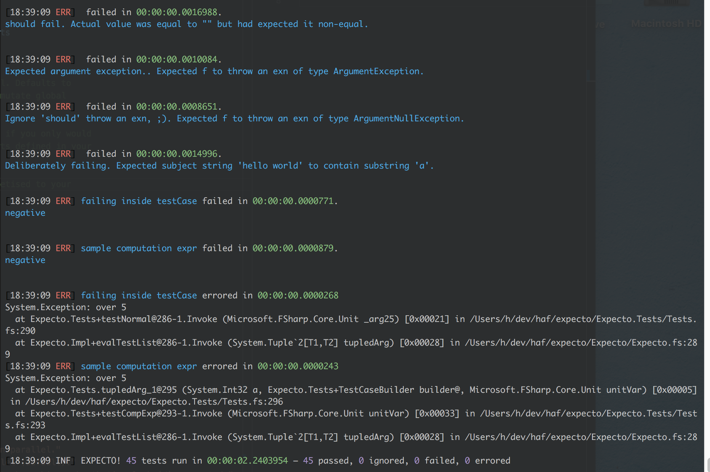

# expecto

[](https://travis-ci.org/haf/expecto)

Expecto is a unit testing library for F#. It's a fork of Fuchu aiming to be
properly updated and pushed to nuget when PRs come in. It aims to be an
opinionated testing framework with batteries included, while still being
compositional (just like Suave and Logary are).



In your paket.dependencies:

```
nuget Expecto
nuget Expecto.PerfUtil
nuget Expecto.FsCheck
```

Tests should be first-class values so that you can move them around and execute
them in any context that you want.

## Testing "Hello world"

The test runner is the test assembly itself. It's recommended to compile your
test assembly as a console application. You can run a test directly like this:

```fsharp
open Expecto

[<Tests>]
let tests =
  testCase "yes" <| fun () ->
    let subject = "Hello world"
    Expect.equal subject "Hello World"
                 "The strings should equal"

[<EntryPoint>]
let main args =
  runTestsInAssembly defaultConfig args
```

The base class is called `Expect`, containing functions you can use to assert
with. A testing library without a good assertion library is like love without
kisses.

Now compile and run! `xbuild Sample.fsproj && mono --debug bin/Debug/Sample.exe`

## Running tests

Here's the simplest test possible:

```fsharp
open Expecto

let simpleTest =
  testCase "A simple test" <| fun _ ->
    let expected = 4
    Expect.equal expected (2+2) "2+2 = 4"
```

Then run it like this, e.g. in the interactive or through a console app.

```fsharp
runParallel simpleTest
// alternatively:
run simpleTest
```

which returns 1 if any tests failed, otherwise 0. Useful for returning to the
operating system as error code.

### `runTests`

Signature `ExpectoConfig -> Test -> int`. Runs the passed tests with the passed
configuration record.

### `runTestsInAssembly`

Signature `ExpectoConfig -> string[] -> int`. Runs the tests in the current
assembly and also overrides the passed `ExpectoConfig` with the command line
parameters.

### `testList` for grouping

Tests can be grouped (with arbitrary nesting):

```fsharp
[<Tests>]
let tests =
  testList "A test group" [
    testCase "one test" <| fun _ ->
      Expect.equal (2+2) 4 "2+2"
    testCase "another test that fails" <| fun _ ->
      Expect.equal (3+3) 5 "3+3"
  ]
```

### Filtering with `filter`

You can single out tests by filtering them by name (e.g. in the
interactive/REPL). For example:

```fsharp
open Expecto
open MyLib.Tests
integrationTests // from MyLib.Tests
|> Test.filter (fun s -> s.EndsWith "another test") // the filtering function
|> run // from Expecto
```

## Expectations

All expect-functions have the signature
`actual -> expected -> PrintfStringFormat<,> -> _`, leaving out
`expected` when obvious from the function; use the printf syntax to interpolate
data into your strings to make your assertions more contextually relevant.

### `Expect` module

This module is your main entry-point when asserting.

 - `throws`
 - `throwsC`
 - `throwsT`
 - `isNone`
 - `isSome`
 - `isChoice1Of2`
 - `isChoice2Of2`
 - `isNotNull`
 - `isNull`
 - `isLessThan`
 - `isLessThanOrEqual`
 - `isGreaterThan`
 - `isGreaterThanOrEqual`
 - `floatEqual`
 - `notEqual`
 - `isFalse`
 - `isTrue`
 - `sequenceEqual`
 - `stringContains`

## `main argv` – how to run console apps

Parameters available if you use `Tests.runTestsInAssembly defaultConfig argv` in your code:

 - `--sequenced`: Run all tests in sequence.
 - `--parallel`: (default) Run all tests in parallel.
 - `--filter <hiera>`: Filter a specific hierarchy to run (**TBD**).
 - `--filter-test-list <substring>`: Filter a specific test list to run
   (**TBD**).
 - `--filter-test-case <substring>`: Filter a specific test case to run
   (**TBD**).

### The config

If you prefer using F# to configure the tests, you can set the properties of the
ExpetoConfig record, that looks like:

```fsharp
{ /// Whether to run the tests in parallel. Defaults to true, because your
  /// code should not mutate global state by default.
  parallel : bool
  /// An optional filter function. Useful if you only would like to run a
  /// subset of all the tests defined in your assembly.
  filter   : Test -> Test
  /// Allows the test printer to be parametised to your liking.
  printer : TestPrinters }
```

By doing a `let config = { defaultConfig with parallel = true }`, for example.

## FsCheck usage

Reference [FsCheck](https://github.com/fscheck/FsCheck) and Expecto.FsCheck to
test properties:

```fsharp
let config = { FsCheck.Config.Default with MaxTest = 10000 }

let properties =
  testList "FsCheck" [
    testProperty "Addition is commutative" <| fun a b ->
      a + b = b + a

    // you can also override the FsCheck config
    testPropertyWithConfig config "Product is distributive over addition" <|
      fun a b c ->
        a * (b + c) = a * b + a * c
  ]

run properties
```

You can freely mix testProperty with testCase and testList.

## PerfUtil usage

The integration with Eirik's PerfUtil project.

```fsharp
open global.PerfUtil

module Types =
  type Y = { a : string; b : int }

type Serialiser =
  inherit ITestable
  abstract member Serialise<'a> : 'a -> unit

type MySlowSerialiser() =
  interface ITestable with
    member x.Name = "Slow Serialiser"
  interface Serialiser with
    member x.Serialise _ =
      System.Threading.Thread.Sleep(30)

type FastSerialiser() =
  interface ITestable with
    member x.Name = "Fast Serialiser"
  interface Serialiser with
    member x.Serialise _ =
      System.Threading.Thread.Sleep(10)

type FastSerialiserAlt() =
  interface ITestable with
    member x.Name = "Fast Serialiser Alt"
  interface Serialiser with
    member x.Serialise _ =
     System.Threading.Thread.Sleep(20)

let alts : Serialiser list =
  [ FastSerialiser()
    FastSerialiserAlt() ]
let subj =
  MySlowSerialiser() :> Serialiser

open Types

let normalSerialisation : PerfTest<Serialiser> list =
  [ perfTest "serialising string" <| fun s ->
      s.Serialise("wowowow")
    perfTest "serialising record" <| fun s ->
      s.Serialise { a = "hello world"; b = 42 }
  ]

[<Tests>]
let tests =
  testList "performance tests" [
    testPerfImpls "implementations of Serialiser" subj alts normalSerialisation
    testPerfHistory "historical MySlowSerialiser" subj "v1.2.3" normalSerialisation
  ]
```

This example shows both a comparison performance test between MySlowSerialiser,
FastSerialiser and FastSerialiserAlt: `testPerfImpls` and a historical
comparison of MySlowSerialiser alone which saves an xml file next to the dll on
every run.

You can find detailed docs in the source code of PerfUtil.fs on all parameters
and data structures. All things that can be configured with PerfUtil can be
configured with the `conf` parameter to `testPerfImplsWithConfig` and
`testPerfHistoryWithConfig`.

The functions are discoverable by starting with `testPerf*`.

Handle the results explicitly by giving a config with a value of
`handleResults`. Use that if you want to export the data to e.g. CSV or TSV.

## You're not alone!

Others have discovered the beauty of tests-as-values in easy-to-read F#.

* [Suave](https://github.com/SuaveIO/suave/tree/master/src/Suave.Tests)
* [Logary](https://github.com/logary/logary)
