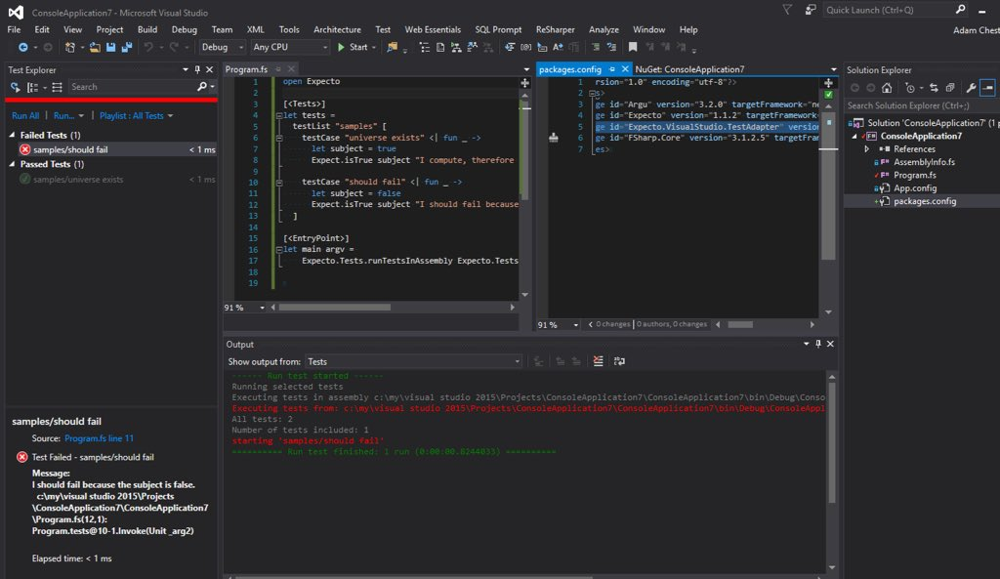

# expecto

[](https://travis-ci.org/haf/expecto)
[](https://ci.appveyor.com/project/haf/expecto)
[](https://www.nuget.org/packages/expecto)

Expecto is a smooth testing library for F#, with **APIs made for humans**,
giving **strong testing methodologies to everyone**.

With Expecto you write tests as values. Tests can be composed, reduced,
filtered, repeated and passed as values, because they are values. This gives the
programmer a lot of leverage when writing tests.

Expecto comes with batteries included, but it's still open for extension due to
its compositional model.

VSCode and Ionide (`ionide-fsharp`) integrate out-of-the-box with Expecto's command-line output.
There's also a nuget `Expecto.VisualStudio.TestAdapter` that you can add to your
test project to enable Visual Studio integration.

Originally, Expecto is a fork of Fuchu aiming to be properly updated and pushed
to nuget when PRs come in. Expecto is part of the F# suite of libraries I've
built or am building, to make F# the most approachable language for system
programming.

 - [Suave](https://suave.io)
 - [Logary](https://github.com/logary/)
 - [Http.fs](https://github.com/haf/Http.fs/)

What follows is the Table of Contents for this README, which also serves as the
documentation for the project.

  * [expecto](#expecto)
    * [Installing](#installing)
    * [Testing "Hello world"](#testing-hello-world)
    * [Running tests](#running-tests)
      * [runTests](#runtests)
      * [runTestsWithArgs](#runtestswithargs)
      * [runTestsInAssembly](#runtestsinassembly)
      * [runTestsInThisAssembly](#runtestsinthisassembly)
      * [Filtering with filter](#filtering-with-filter)
      * [Stress testing](#stress-testing)
    * [Writing tests](#writing-tests)
      * [Normal tests](#normal-tests)
      * [testList for grouping](#testlist-for-grouping)
      * [Test fixtures](#test-fixtures)
      * [Pending tests](#pending-tests)
      * [Focusing tests](#focusing-tests)
      * [Sequenced tests](#sequenced-tests)
      * [Parametised tests with testParam](#parametised-tests-with-testparam)
      * [Property based tests](#property-based-tests)
        * [Link collection](#link-collection)
        * [Code from FsCheck](#code-from-fscheck)
      * [Performance tests](#performance-tests)
    * [Expectations with Expect](#expectations-with-expect)
      * [Expect module](#expect-module)
      * [Performance module](#performance-module)
        * [Example](#example)
    * [main argv – how to run console apps](#main-argv--how-to-run-console-apps)
      * [The config](#the-config)
    * [Contributing](#contributing)
    * [BenchmarkDotNet usage](#benchmarkdotnet-usage)
    * [You're not alone\!](#youre-not-alone)
    * [Sending e\-mail on failure – custom printers](#sending-e-mail-on-failure--custom-printers)
    * [About test parallelism](#about-test-parallelism)
    * [About upgrading from Fuchu](#about-upgrading-from-fuchu)
      * [Why the strange name?](#why-the-strange-name)
      * [What does 'expected to have type TestCode' mean?](#what-does-expected-to-have-type-testcode-mean)


## Installing

In your paket.dependencies:

```
nuget Expecto
nuget Expecto.BenchmarkDotNet
nuget Expecto.FsCheck
```

Tests should be first-class values so that you can move them around and execute
them in any context that you want.

Let's have look at what an extensive unit test suite looks like when running
with Expecto:


## Testing "Hello world"

The test runner is the test assembly itself. It's recommended to compile your
test assembly as a console application. You can run a test directly like this:

```fsharp
open Expecto

let tests =
  testCase "A simple test" <| fun () ->
    let subject = "Hello world"
    Expect.equal subject "Hello World"
                 "The strings should equal"

[<EntryPoint>]
let main args =
  runTestsWithArgs defaultConfig args tests
```

No magic is involved here. We just created a single test and hooked it 
into the assembly entry point.

The `Expect` module contains functions that you can use to assert with. 
A testing library without a good assertion library is like love without kisses.

Now compile and run! `xbuild Sample.fsproj && mono --debug bin/Debug/Sample.exe`

## Running tests

Here's the simplest test possible:

```fsharp
open Expecto

let simpleTest =
  testCase "A simple test" <| fun () ->
    let expected = 4
    Expect.equal expected (2+2) "2+2 = 4"
```

Then run it like this, e.g. in the interactive or through a console app.

```fsharp
runTests defaultConfig simpleTest
```

which returns 1 if any tests failed, otherwise 0. Useful for returning to the
operating system as error code.

It's worth noting that `<|` is just a way to change the associativity of the
language parser. In other words; it's equivalent to:

```fsharp
testCase "A simple test" (fun () ->
  Expect.equal 4 (2+2) "2+2 should equal 4")
```

### `runTests`

Signature `ExpectoConfig -> Test -> int`. Runs the passed tests with the passed
configuration record.

### `runTestsWithArgs`

Signature `ExpectoConfig -> string[] -> Test -> int`. Runs the passed tests
and also overrides the passed `ExpectoConfig` with the command line parameters.

### `runTestsInAssembly`

Signature `ExpectoConfig -> string[] -> Assembly -> int`. Runs the tests in the passed in
assembly and also overrides the passed `ExpectoConfig` with the command line
parameters. All tests need to be marked with the `[<Tests>]` attribute.

### `runTestsInThisAssembly`

Signature `ExpectoConfig -> string[] -> int`. Runs the tests in the current
assembly and also overrides the passed `ExpectoConfig` with the command line
parameters. All tests need to be marked with the `[<Tests>]` attribute.

### Filtering with `filter`

You can single out tests by filtering them by name (e.g. in the
interactive/REPL). For example:

```fsharp
open Expecto
open MyLib.Tests
integrationTests // from MyLib.Tests
|> Test.filter (fun s -> s.EndsWith "another test") // the filtering function
|> runTests defaultConfig
```
### Stress testing

Tests can also be run randomly for a fixed length of time.
The idea is that this will catch the following types of bugs:

- Memory leaks.
- Threading bugs running same test at same time.
- Rare threading bugs.
- Rare property test fails.

The default config will run FsCheck tests with a higher end size than normal.

## Writing tests

Expecto supports the following test constructors:

 - normal test cases with `testCase` and `testCaseAsync`
 - lists of tests with `testList`
 - test fixtures with `testFixture`
 - pending tests (that aren't run) with `ptestCase` and `ptestCaseAsync`
 - focused tests (that are the only ones run) with `ftestCase` and `ftestCaseAsync`
 - sequenced tests with `testSequenced` and `testSequencedGroup`
 - parametised tests with `testParam`
 - testCases with the workflow builder `test`, `ptest`, `ftest` supporting
   deterministic disposal, loops and such
 - property based tests with `testProperty`, `testPropertyWithConfig` and `testPropertyWithConfigs` from
   `Expecto.FsCheck`
 - performance tests with `Expecto.BenchmarkDotNet` and
   `benchmark<TBench> : string -> Test`.

All of the above compile to a `Test` value that you can compose. For example,
you can compose a `test` and a `testCaseAsync` in a `testList` which you wrap in
`testSequenced` because all tests in the list use either `Expect.fasterThan` or
they are using `Expecto.BenchmarkDotNet` for performance tests.

### Normal tests

 - `testCase : string -> (unit -> unit) -> Test`
 - `test : string -> TestCaseBuilder`
 - `testCaseAsync : string -> Async<unit> -> Test`

### `testList` for grouping

Tests can be grouped (with arbitrary nesting):

```fsharp

let tests =
  testList "A test group" [
    testCase "one test" <| fun () ->
      Expect.equal (2+2) 4 "2+2"

    testCase "another test that fails" <| fun () ->
      Expect.equal (3+3) 5 "3+3"

    testCaseAsync "this is an async test" async {
      do! async.Return()
    }
  ]
```

Also have a look at [the
samples](https://github.com/haf/expecto/blob/master/Expecto.Sample/Expecto.Sample.fs).

### Test fixtures

 - `testFixture : ('a -> unit -> unit) -> (seq<string * 'a>) -> seq<Test>`

The test fixture takes a factory and a sequence of partial tests. The `'a`
parameter will be inferred to the *function type*, such as
`MemoryStream -> 'a -> unit -> 'a`.

Example:

```fsharp
testList "Setup & teardown 3" [
  let withMemoryStream f () =
    use ms = new MemoryStream()
    f ms
  yield! testFixture withMemoryStream [
    "can read",
      fun ms -> ms.CanRead ==? true
    "can write",
      fun ms -> ms.CanWrite ==? true
  ]
]
```

### Pending tests

 - `ptestCase`
 - `ptest`
 - `ptestCaseAsync`

You can mark an individual spec or container as Pending. This will prevent the
spec (or specs within the list) from running.  You do this by adding a `p`
before *testCase* or *testList* or `P` before *Tests* attribute (when reflection
tests discovery is used).

```fsharp
open Expecto

[<PTests>]
let skippedTestFromReflectionDiscovery = testCase "skipped" <| fun () ->
    Expect.equal (2+2) 4 "2+2"

[<Tests>]
let myTests =
  testList "normal" [
    testList "unfocused list" [
      ptestCase "skipped" <| fun () -> Expect.equal (2+2) 1 "2+2?"
      testCase "will run" <| fun () -> Expect.equal (2+2) 4 "2+2"
      ptest "skipped" { Expect.equal (2+2) 1 "2+2?" }
    ]
    testCase "will run" <| fun () -> Expect.equal (2+2) 4 "2+2"
    ptestCase "skipped" <| fun () -> Expect.equal (2+2) 1 "2+2?"
    ptestList "skipped list" [
      testCase "skipped" <| fun () -> Expect.equal (2+2) 1 "2+2?"
      ftestCase "skipped" <| fun () -> Expect.equal (2+2) 1 "2+2?"
    ]
  ]
```

Optionally, in the `TestCode` (function body):

 - `Tests.skiptest`
 - `Tests.skiptestf`

### Focusing tests

Focusing can be done with

 - `ftestCase`
 - `ftestList`
 - `ftestCaseAsync`
 - `ftest`

It is often convenient, when developing to be able to run a subset of specs.
Expecto allows you to focus specific test cases or tests list by putting `f` before *testCase* or *testList* or `F` before attribute *Tests*(when reflection tests discovery is used).

```fsharp
open Expecto

[<FTests>]
let someFocusedTest = testCase "will run" <| fun () -> Expect.equal (2+2) 4 "2+2"
[<Tests>]
let someUnfocusedTest = test "skipped" { Expect.equal (2+2) 1 "2+2?" }
```

or

```fsharp
open Expecto

[<Tests>]
let focusedTests =
  testList "unfocused list" [
    ftestList "focused list" [
      testCase "will run" <| fun () -> Expect.equal (2+2) 4 "2+2"
      ftestCase "will run" <| fun () -> Expect.equal (2+2) 4 "2+2"
      test "will run" { Expect.equal (2+2) 4 "2+2" }
    ]
    testList "unfocused list" [
      testCase "skipped" <| fun () -> Expect.equal (2+2) 1 "2+2?"
      ftestCase "will run" <| fun () -> Expect.equal (2+2) 4 "2+2"
      test "skipped" { Expect.equal (2+2) 1 "2+2?" }
      ftest "will run" { Expect.equal (2+2) 4 "2+2" }
    ]
    testCase "skipped" <| fun () -> Expect.equal (2+2) 1 "2+2?"
  ]
```

Expecto accepts the command line argument `--fail-on-focused-tests`, which checks if focused tests exist.
This parameter can be set in build scripts and allows CI servers to reject commits that accidentally included focused tests.

### Sequenced tests

You can mark an individual spec or container as Sequenced.
This will make sure these tests are run sequentially.
This can be useful for timeout and performance testing.

```fsharp
[<Tests>]
let timeout =
  testSequenced <| testList "Timeout" [
    testCase "fail" <| fun () ->
      let test = TestCase(Test.timeout 10 (fun () -> Thread.Sleep 100), Normal)
      let result = evalSilent test |> sumTestResults
      result.failed.Length ==? 1
    testCase "pass" <| fun () ->
      let test = TestCase(Test.timeout 1000 ignore, Normal)
      let result = evalSilent test |> sumTestResults
      result.passed.Length ==? 1
  ]
```

You can also mark a test list as a Sequenced Group.
This will make sure the tests in this group are not run at the same time.

```fsharp
[<Tests>]
let timeout =
  let lockOne = obj()
  let lockTwo = obj()
  testSequencedGroup "stop deadlock" <| testList "possible deadlock" [
    testCaseAsync "case A" <| async {
      lock lockOne (fun () ->
        Thread.Sleep 10
        lock lockTwo (fun () ->
          ()
        )
      )
    }
    testCaseAsync "case B" <| async {
      lock lockTwo (fun () ->
        Thread.Sleep 10
        lock lockOne (fun () ->
          ()
        )
      )
    }
  ]
```

### Parametised tests with `testParam`

 - `testParam`

```fsharp
testList "numberology 101" (
  testParam 1333 [
    "First sample",
      fun value () ->
        Expect.equal value 1333 "Should be expected value"
    "Second sample",
      fun value () ->
        Expect.isLessThan value 1444 "Should be less than"
] |> List.ofSeq)
```

### Property based tests

Reference [FsCheck](https://github.com/fscheck/FsCheck) and Expecto.FsCheck to
test properties.

```fsharp
module MyApp.Tests

// the ExpectoFsCheck module is auto-opened by this
// the configuration record is in the Expecto namespace in the core library
open Expecto

let config = { FsCheckConfig.defaultConfig with maxTest = 100 }
let stressConfig = { FsCheckConfig.defaultConfig with maxTest = 10000 }

let properties =
  testList "FsCheck" [
    testProperty "Addition is commutative" <| fun a b ->
      a + b = b + a

    // you can also override the FsCheck config
    testPropertyWithConfig config "Product is distributive over addition" <|
      fun a b c ->
        a * (b + c) = a * b + a * c

    // you can apply a different config for stress testing for each test
    testPropertyWithConfigs config stressConfig "different config for stress testing" <|
      fun a b c ->
        a * (b + c) = a * b + a * c

    // you can also focus on a StdGen seed value (failing test will give you this)
    ftestProperty (12345,67890) "Focused on seed" <| fun a b ->
      a + b = b + a
  ]

run properties
```

You can freely mix testProperty with testCase and testList. The config looks
like the following.

```fsharp
type FsCheckConfig =
  { maxTest: int
    startSize: int
    endSize: int
    replay: (int*int) option
    arbitrary: Type list }
```

It will be translated to the FsCheck-specific configuration at runtime.

#### Link collection

These are a few resources that will get you on your way towards fully-specified
systems with property-based testing.

 - [An introduction to property-based testing](http://fsharpforfunandprofit.com/posts/property-based-testing/) with [slides and video](http://fsharpforfunandprofit.com/pbt/)
 - [Choosing properties for property-based testing](http://fsharpforfunandprofit.com/posts/property-based-testing-2/)
 - [(video) Race conditions, distribution and interactions](https://vimeo.com/68383317)
 - [Test data: generators, schrinkers and instances](https://fscheck.github.io/FsCheck/TestData.html)
 - [Model based testing](https://fscheck.github.io/FsCheck/StatefulTesting.html)
 - [Testing and quality assurance in Haskell](http://book.realworldhaskell.org/read/testing-and-quality-assurance.html)
 - [Property-based testing for better code](https://www.youtube.com/watch?v=shngiiBfD80)

#### Code from FsCheck

These code snippets show a bit of the API usage and how to create Arbitrary
instances (which encapsulate generation with Gen instances and shrinkage),
respectively.

 - [FsCheck Examples.fs](https://github.com/fscheck/FsCheck/blob/master/examples/FsCheck.Examples/Examples.fs)
 - [FsCheck Arbitrary.fs](https://github.com/fscheck/FsCheck/blob/master/src/FsCheck/Arbitrary.fs#L26)

### Performance tests

See the BenchmarkDotNet section below.

## Expectations with `Expect`

All expect-functions have the signature `actual -> expected -> string -> unit`,
leaving out `expected` when obvious from the function.

### `Expect` module

This module is your main entry-point when asserting.

 - `throws`
 - `throwsC`
 - `throwsT`
 - `isNone`
 - `isSome`
 - `isChoice1Of2`
 - `isChoice2Of2`
 - `isNull`
 - `isNotNull`
 - `isNotNaN`
 - `isNotPositiveInfinity`
 - `isNotNegativeInfinity`
 - `isNotInfinity`
 - `isLessThan`
 - `isLessThanOrEqual`
 - `isGreaterThan`
 - `isGreaterThanOrEqual`
 - `notEqual`
 - `isFalse`
 - `isTrue`
 - `sequenceEqual`
 - `floatClose : Accuracy -> float -> float -> string -> unit` - Expect the
   floats to be within the combined absolute and relative accuracy given by
   `abs(a-b) <= absolute + relative * max (abs a) (abs b)`. Default accuracy
   available are: `Accuracy.low = {absolute=1e-6; relative=1e-3}`,
   `Accuracy.medium = {absolute=1e-8; relative=1e-5}`,
   `Accuracy.high = {absolute=1e-10; relative=1e-7}`,
   `Accuracy.veryHigh = {absolute=1e-12; relative=1e-9}`.
 - `sequenceStarts` - Expect the sequence `subject` to start with `prefix`. If
   it does not then fail with `format` as an error message together with a
   description of `subject` and `prefix`.
 - `isAscending` - Expect the sequence `subject` to be ascending. If it does not
   then fail with `format` as an error message.
 - `isDescending` - Expect the sequence `subject` to be descending. If it does
   not then fail with `format` as an error message.
 - `stringContains` – Expect the string `subject` to contain `substring` as part
   of itself.  If it does not, then fail with `format` and `subject` and
   `substring` as part of the error message.
 - `stringStarts` – Expect the string `subject` to start with `prefix` and if it
   does not then fail with `format` as an error message together with a
   description of `subject` and `prefix`.
 - `stringEnds` - Expect the string `subject` to end with `suffix`. If it does
   not then fail with `format` as an error message together with a description
   of `subject` and `suffix`.
 - `stringHasLength` - Expect the string `subject` to have length equals
   `length`. If it does not then fail with `format` as an error message together
   with a description of `subject` and `length`.
 - `isNotEmpty` - Expect the string `actual` to be not null nor empty
 - `isNotWhitespace` - Expect the string `actual` to be not null nor empty nor whitespace
 - `contains : 'a seq -> 'a -> string -> unit` – Expect the sequence to contain
   the item.
 - `containsAll: 'a seq -> 'a seq -> string -> unit` - Expect the sequence
   contains all elements from second sequence (not taking into account an order
   of elements)
 - `distribution: 'a seq -> Map<'a, uint32> -> string -> unit` - Expect the sequence contains all elements from map (first element in tuple is an item expected to be in sequence, second is a positive number of its occurrences in a sequence). Function is not taking into account an order of elements.
 - `streamsEqual` – Expect the streams to be byte-wise identical.
 - `isFasterThan : (unit -> 'a) -> (unit -> 'a) -> string -> unit` – Expect the
    first function to be faster than the second function with the passed string
    message, printed on failure. See the next section on Performance for example
    usage.
 - `isFasterThanSub` – Like the above but with passed function signature of
   `Performance.Measurer<unit,'a> -> 'a`, allowing you to do setup and teardown
   of your subject under test (the function) before calling the Measurer. See
   the next section on Performance for example usage.

### `Performance` module

Expecto supports testing that an implementation is faster than another. Use it
by calling `Expect.isFasterThan` wrapping your `Test` in `testSequenced`.


This function makes use of a statistical test called [Welch's t-test](https://en.wikipedia.org/wiki/Welch's_t-test).
It starts with the null hypothesis that the functions mean execution times are the same.
The functions are run alternately increasing the sample size to test this hypothesis.

Once the probability of getting this result based on the null hypothesis goes below 0.01% it rejects the null hypothesis and reports the results.
If the performance is very close the test will declare them equal when there is 99.99% confidence they differ by less than 0.5%.
0.01%/99.99% are chosen such that if a test list has 100 performance tests a false test failure would be reported once in many more than 100 runs.

This results in a performance test that is very quick to run (the greater the difference the quicker it will run).
Also, because it is a relative test it can normally be run across all configurations as part of unit testing.

The functions must return the same result for same input. Note that since
Expecto also has a FsCheck integration, your outer (sequenced) test could be
the property test, generating random data, and your TestCode/function body/
actual test could be an assertion that for the same (random instance) of test-
data, one function should be faster than the other.

From `Expect.isFasterThanSub`, these results are possible (all of which generate
a test failure, except the MetricLessThan case):

```fsharp
  type 'a CompareResult =
    | ResultNotTheSame of result1:'a * result2:'a
    | MetricTooShort of sMax:SampleStatistics * machineResolution:SampleStatistics
    | MetricLessThan of s1:SampleStatistics * s2:SampleStatistics
    | MetricMoreThan of s1:SampleStatistics * s2:SampleStatistics
    | MetricEqual of s1:SampleStatistics * s2:SampleStatistics
```

You can explore these cases yourself with `Expecto.Performance.timeCompare`,
should you wish to.

#### Example

All of the below tests pass.

```fsharp
[<Tests>]
let performance =
  testSequenced <| testList "performance" [

    testCase "1 <> 2" <| fun () ->
      let test () =
        Expect.isFasterThan (fun () -> 1) (fun () -> 2) "1 equals 2 should fail"
      assertTestFailsWithMsgContaining "same" (test, Normal)

    testCase "half is faster" <| fun () ->
      Expect.isFasterThan (fun () -> repeat10000 log 76.0)
                          (fun () -> repeat10000 log 76.0 |> ignore; repeat10000 log 76.0)
                          "half is faster"

    testCase "double is faster should fail" <| fun () ->
      let test () =
        Expect.isFasterThan (fun () -> repeat10000 log 76.0 |> ignore; repeat10000 log 76.0)
                            (fun () -> repeat10000 log 76.0)
                            "double is faster should fail"
      assertTestFailsWithMsgContaining "slower" (test, Normal)

    ptestCase "same function is faster should fail" <| fun () ->
      let test () =
        Expect.isFasterThan (fun () -> repeat100000 log 76.0)
                            (fun () -> repeat100000 log 76.0)
                            "same function is faster should fail"
      assertTestFailsWithMsgContaining "equal" (test, Normal)

    testCase "matrix" <| fun () ->
      let n = 100
      let rand = Random 123
      let a = Array2D.init n n (fun () _ -> rand.NextDouble())
      let b = Array2D.init n n (fun () _ -> rand.NextDouble())
      let c = Array2D.zeroCreate n n

      let reset() =
        for i = 0 to n-1 do
            for j = 0 to n-1 do
              c.[i,j] <- 0.0

      let mulIJK() =
        for i = 0 to n-1 do
          for j = 0 to n-1 do
            for k = 0 to n-1 do
              c.[i,k] <- c.[i,k] + a.[i,j] * b.[j,k]

      let mulIKJ() =
        for i = 0 to n-1 do
          for k = 0 to n-1 do
            let mutable t = 0.0
            for j = 0 to n-1 do
              t <- t + a.[i,j] * b.[j,k]
            c.[i,k] <- t
      Expect.isFasterThanSub (fun measurer -> reset(); measurer mulIKJ ())
                             (fun measurer -> reset(); measurer mulIJK ())
                             "ikj faster than ijk"

    testCase "popcount" <| fun () ->
      let test () =
        Expect.isFasterThan (fun () -> repeat10000 (popCount16 >> int) 987us)
                            (fun () -> repeat10000 (popCount >> int) 987us)
                            "popcount 16 faster than 32 fails"
      assertTestFailsWithMsgContaining "slower" (test, Normal)
  ]
```

A failure would look like this:

```
[13:23:19 ERR] performance/double is faster failed in 00:00:00.0981990.
double is faster. Expected f1 (0.3067 ± 0.0123 ms) to be faster than f2 (0.1513 ± 0.0019 ms) but is ~103% slower.
```

## `main argv` – how to run console apps

Parameters available if you use `Tests.runTestsInThisAssembly defaultConfig argv` in your code:

 - `--debug`: Extra verbose output for your tests.
 - `--sequenced`: Run all tests in sequence.
 - `--parallel`: (default) Run all tests in parallel.
 - `--parallel-workers`: Number of parallel workers (defaults to the number of logical processors).
 - `--filter <hiera>`: Filter a specific hierarchy to run.
 - `--filter-test-list <substring>`: Filter a specific test list to run.
 - `--filter-test-case <substring>`: Filter a specific test case to run.
 - `--run [<tests1> <test2> ...]`: Run only provided tests.
 - `--stress`: Run the tests randomly for the given number of minutes.
 - `--stress-timeout`: Time to wait in minutes after the stress test before reporting as a deadlock (default 5 mins).
 - `--stress-memory-limit`: Stress test memory limit in MB to stop the test and report as a memory leak (default 100 MB).
 - `--fscheck-max-tests`: FsCheck maximum number of tests (default: 100).
 - `--fscheck-start-size`: FsCheck start size (default: 1).
 - `--fscheck-end-size`: FsCheck end size (default: 100 for testing and 10,000 for stress testing).
 - `--list-tests`: Doesn't run tests, print out list of tests instead.
 - `--summary`: Prints out summary after all tests are finished.

### The config

If you prefer using F# to configure the tests, you can set the properties of the
ExpectoConfig record, that looks like:

```fsharp
{ /// Whether to run the tests in parallel. Defaults to
  /// true, because your code should not mutate global
  /// state by default.
  parallel : bool
  /// Number of parallel workers. Defaults to the number of
  /// logical processors.
  parallelWorkers : int
  /// Stress test by running tests randomly for the given TimeSpan.
  /// Can be sequenced or parallel depending on the config.
  stress : TimeSpan option
  /// Stress test deadlock timeout TimeSpan to wait after stress TimeSpan
  /// before stopping and reporting as a deadlock (default 5 mins).
  stressTimeout : TimeSpan
  /// Stress test memory limit in MB to stop the test and report as
  /// a memory leak (default 100 MB)
  stressMemoryLimit : float
  /// Whether to make the test runner fail if focused tests exist.
  /// This can be used from CI servers to ensure no focused tests are
  /// commited and therefor all tests are run.
  failOnFocusedTests : bool
  /// An optional filter function. Useful if you only would
  /// like to run a subset of all the tests defined in your assembly.
  filter   : Test -> Test
  /// Allows the test printer to be parametised to your liking.
  printer : TestPrinters
  /// Verbosity level (default: Info).
  verbosity : LogLevel
  /// Optional function used for finding source code location of test
  /// Defaults to empty source code.
  locate : TestCode -> SourceLocation
  /// FsCheck maximum number of tests (default: 100).
  fsCheckMaxTests: int
  /// FsCheck start size (default: 1).
  fsCheckStartSize: int
  /// FsCheck end size (default: 100 for testing and 10,000 for
  /// stress testing).
  fsCheckEndSize: int option
}
```

By doing a `let config = { defaultConfig with parallel = true }`, for example.

## Contributing

Please see the [Devguide](./DEVGUIDE.md).

## BenchmarkDotNet usage

The integration with
[BenchmarkDotNet](https://perfdotnet.github.io/BenchmarkDotNet/index.htm).

```fsharp
open Expecto
open BenchmarkDotNet

module Types =
  type Y = { a : string; b : int }

type Serialiser =
  abstract member Serialise<'a> : 'a -> unit

type MySlowSerialiser() =
  interface Serialiser with
    member x.Serialise _ =
      System.Threading.Thread.Sleep(30)

type FastSerialiser() =
  interface Serialiser with
    member x.Serialise _ =
      System.Threading.Thread.Sleep(10)

type FastSerialiserAlt() =
  interface Serialiser with
    member x.Serialise _ =
     System.Threading.Thread.Sleep(20)

type Serialisers() =
  let fast, fastAlt, slow =
    FastSerialiser() :> Serialiser,
    FastSerialiserAlt() :> Serialiser,
    MySlowSerialiser() :> Serialiser

  [<Benchmark>]
  member x.FastSerialiserAlt() = fastAlt.Serialise "Hello world"

  [<Benchmark>]
  member x.SlowSerialiser() = slow.Serialise "Hello world"

  [<Benchmark(Baseline = true)>]
  member x.FastSerialiser() = fast.Serialise "Hello world"

open Types

[<Tests>]
let tests =
  testList "performance tests" [
    benchmark<Serialisers> "three serialisers" benchmarkConfig ignore
  ]
```

In the current code-base I'm just printing the output to the console; and by
default all tests are run in parallel; so you'll need to use `--sequenced` as
input to your exe, or set parallel=false in the config to get valid results.

To read more about how to benchmark with BenchmarkDotNet, see its [Getting
started](http://benchmarkdotnet.org/GettingStarted.htm) guide.

Happy benchmarking!

## You're not alone!

Others have discovered the beauty of tests-as-values in easy-to-read F#.

* [Suave](https://github.com/SuaveIO/suave/tree/master/src/Suave.Tests)
* [Logary](https://github.com/logary/logary)
* [Unquote has built-in support](https://github.com/SwensenSoftware/unquote/pull/128)
* [Visual Studio Plugin for
  Expecto](https://www.nuget.org/packages/Expecto.VisualStudio.TestAdapter/) –
  just add the `nuget Expecto.VisualStudio.TestAdapter version_in_path: true` to
  your paket file and you're off to the races!

.

## Sending e-mail on failure – custom printers

The printing mechanism in Expecto is based on the [Logary
Facade](https://github.com/logary/logary#the-logary-facade-adapter), which
grants some privileges, like being able to use **any** Logary target to print.
Just follow the above link to learn how to initialise Logary. Then if you wanted
to get notified over e-mail whenever one of your tests fail, configure Logary
with `Logary.Targets.Mailgun`:

```fsharp
open Logary
open Logary.Configuration
open Logary.Adapters.Facade
open Logary.Targets
open Hopac
open Mailgun
open System.Net.Mail

let main argv =
  let mgc =
    MailgunLogaryConf.Create(
      MailAddress("travis@example.com"),
      [ MailAddress("Your.Mail.Here@example.com") ],
      { apiKey = "deadbeef-2345678" },
      "example.com", // sending domain of yours
      Error) // cut-off level

  use logary =
    withLogaryManager "MyTests" (
      withTargets [
        LiterateConsole.create LiterateConsole.empty "stdout"
        Mailgun.create mgc "mail"
      ]
      >> withRules [
        Rule.createForTarget "stdout"
        Rule.createForTarget "mail"
      ])
    |> run

  // initialise Logary Facade with Logary proper:
  LogaryFacadeAdapter.initialise<Expecto.Logging.Logger> logary

  // run all tests
  Tests.runTestsInThisAssembly defaultConfig args
```

## About test parallelism

Since the default is to run all of your tests in parallel, it's important that
you don't use global variables, global singletons or mutating code. If you do,
you'll have to slow down all of your tests by sequencing them (or use locks in
your testing code).

Furthermore, `printfn` and sibling functions aren't thread-safe, i.e. a given
string may be logged in many passes and concurrent calls to printfn and
Console.X-functions have their outputs interleaved. If you want to log from
tests, you can use code like:

```fsharp
open Expecto.Logging
open Expecto.Logging.Message

let logger = Log.create "MyTests"

// stuff here

testCase "reading prop" <| fun () ->
  let subject = MyComponent()
  // this will output to the right test context:
  logger.info(
    eventX "Has prop {property}"
    >> setField "property" subject.property)
  Expect.equal subject.property "Goodbye" "Should have goodbye as its property"
```

## About upgrading from Fuchu

In VsCode, search files for: `Assert.Equal\s*\(\s*((;|.)+?)\s*,\s*(.*?),\s*(.*?)\)`
and replace with `Expect.equal $4 $3 $1`.

### Why the strange name?


### What does 'expected to have type TestCode' mean?

If you get an error message like this:

```
This expression was expected to have type    'TestCode'    but here has type    'unit'
```

It means that you have code like `testCase "abc" <| Expect.equal ...`. Instead
you should create a function like so: `testCase "abc" <| fun () -> Expect.equal
...`.
